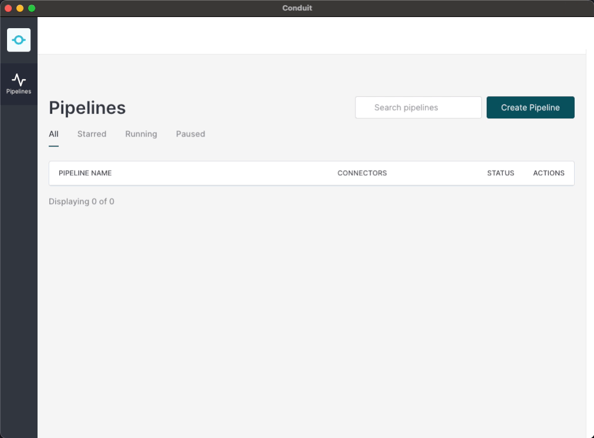

# Conduit


_Data Integration for Production Data Stores. :dizzy:_

[](https://github.com/ConduitIO/conduit/blob/main/LICENSE.md)
[](https://github.com/ConduitIO/conduit/actions/workflows/build.yml)
[](https://goreportcard.com/report/github.com/conduitio/conduit)
[](https://discord.meroxa.com)
[](https://pkg.go.dev/github.com/conduitio/conduit)
[](https://www.conduit.io/docs/introduction/getting-started)
[](https://docs.conduit.io/api)

## Overview

Conduit is a data streaming tool written in Go. It aims to provide the best user experience for building and running
real-time data pipelines. Conduit comes with batteries included, it provides a UI, common connectors, transforms and
observability data out of the box.

Conduit pipelines are built out of simple building blocks which run in their own goroutines and are connected using Go
channels. This makes Conduit pipelines incredibly performant on multi-core machines. Conduit guarantees the order of
received records won't change, it also takes care of consistency by propagating acknowledgments to the start of the
pipeline only when a record is successfully processed on all destinations.

Conduit connectors are plugins that communicate with Conduit via a gRPC interface. This means that plugins can be
written in any language as long as they conform to the required interface.

Conduit was created and open-sourced by [Meroxa](https://meroxa.io).

- [Installation guide](#installation-guide)
- [Connectors](#connectors)
- [Testing](#testing)
- [API](#api)
- [UI](#ui)
- [Documentation](#documentation)
- [Known limitations](#known-limitations)
- [Contributing](#contributing)

## Installation guide

### Download release

Download a pre-built binary from the [latest release](https://github.com/conduitio/conduit/releases/latest) and simply
run it!

```
./conduit
```

Once you see that the service is running you may access a user-friendly web interface at `http://localhost:8080/ui/`.
You can also interact with the [Conduit API](#api) directly, we recommend navigating to `http://localhost:8080/openapi/`
and exploring the HTTP API through Swagger UI.

### Build from source

Requirements:
* [Go](https://golang.org/) (1.17 or later)
* [Node.js](https://nodejs.org/) (16.x)
* [Yarn](https://yarnpkg.com/) (latest 1.x)
* [Ember CLI](https://ember-cli.com/)
* [Make](https://www.gnu.org/software/make/)

```shell
git clone git@github.com:ConduitIO/conduit.git
cd conduit
make
./conduit
```

Note that you can also build Conduit with `make build-server`, which only compiles the server and skips the UI. This command
requires only Go and builds the binary much faster. That makes it useful for development purposes or for running Conduit
as a simple backend service.

### Docker

Our Docker images are hosted on GitHub's Container Registry. To pull the latest tag, you should run the following command:

```
docker pull ghcr.io/conduitio/conduit:latest
```

The Docker images include the [UI](#ui).

## Connectors

Conduit ships with a number of built-in connectors:

- [File connector](https://github.com/ConduitIO/conduit-connector-file) provides a source/destination to read/write a local file (useful for quickly trying out Conduit without additional setup).
- [Kafka connector](https://github.com/ConduitIO/conduit-connector-kafka) provides a source/destination for Apache Kafka.
- [Postgres connector](https://github.com/ConduitIO/conduit-connector-postgres) provides a source/destination for PostgreSQL.
- [S3 connector](https://github.com/ConduitIO/conduit-connector-s3) provides a source/destination for AWS S3.
- [Generator connector](https://github.com/ConduitIO/conduit-connector-generator) provides a source which generates random data (useful for testing).

Additionally, we have prepared a [Kafka Connect wrapper](https://github.com/conduitio/conduit-kafka-connect-wrapper) that allows you to run any Apache 
Kafka Connect connector as part of a Conduit pipeline.

Conduit is also able to run standalone connectors, if you are interested in writing a connector yourself have a look at our [Go Connector SDK](https://github.com/ConduitIO/conduit-connector-sdk). Since standalone connectors communicate with Conduit through gRPC they can be written in virtually any programming language, as long as the connector follows the [Conduit Connector Protocol](https://github.com/ConduitIO/conduit-connector-protocol).

## Testing

Conduit tests are split in two categories: unit tests and integration tests. Unit tests can be run without any
additional setup while integration tests require additional services to be running (e.g. Kafka or Postgres).

Unit tests can be run with `make test`.

Integration tests require [Docker](https://www.docker.com/) to be installed and running, they can be run with
`make test-integration`. This command will handle starting and stopping docker containers for you.

## API

Conduit exposes a gRPC API and an HTTP API.

The gRPC API is by default running on port 8084. You can define a custom address using the CLI flag `-grpc.address`. To
learn more about the gRPC API please have a look at the
[protobuf file](https://github.com/ConduitIO/conduit/blob/main/proto/api/v1/api.proto).

The HTTP API is by default running on port 8080. You can define a custom address using the CLI flag `-http.address`. It
is generated using [gRPC gateway](https://github.com/grpc-ecosystem/grpc-gateway) and is thus providing the same
functionality as the gRPC API. To learn more about the HTTP API please have a look at the [API documentation](https://www.conduit.io/api), 
[OpenAPI definition](https://github.com/ConduitIO/conduit/blob/main/pkg/web/openapi/swagger-ui/api/v1/api.swagger.json)
or run Conduit and navigate to `http://localhost:8080/openapi/` to open a
[Swagger UI](https://github.com/swagger-api/swagger-ui) which makes it easy to try it out.

## UI

Conduit comes with a web UI that makes building data pipelines a breeze, you can access it at
`http://localhost:8080/ui/`. See the [installation guide](#build-from-source) for instructions on how to build Conduit
with the UI.

For more information about the UI refer to the [Readme](ui/README.md) in `/ui`.



## Documentation

To learn more about how to use Conduit visit [docs.conduit.io](https://docs.conduit.io).

If you are interested in internals of Conduit we have prepared some technical documentation:
* [Conduit Architecture](https://github.com/ConduitIO/conduit/blob/main/docs/architecture.md) will give you a high-level
  overview of Conduit.
* [Conduit Metrics](https://github.com/ConduitIO/conduit/blob/main/docs/metrics.md) provides more information about how
  Conduit exposes metrics.

## Known limitations

While Conduit is built on strong foundations and experiences from running similar systems, it's not production ready
at the moment. Following features are on the roadmap and yet to be implemented:
1. Standard record format - we plan to have the records implement a single standard for CDC events.
2. Delivery and ordering guarantees - from the experience we have so far, messages created internally are reliably delivered through
   Conduit (from source nodes, over processing nodes to destination nodes). However, we still need good end-to-end, full-scale
   tests to actually prove that.
3. Performance guarantees (for the core) - reasons are identical to reasons for delivery guarantees.
4. Dynamic loading of list of plugins - currently, the API cannot return the list of all available plugins and the available
   configuration parameters. Consequently, the UI has the plugin paths and configuration parameters hard-coded.

## Contributing

For a complete guide to contributing to Conduit, see the
[Contribution Guide](https://github.com/ConduitIO/conduit/blob/master/CONTRIBUTING.md).

We welcome you to join the community and contribute to Conduit to make it better! When something does not work as
intended please check if there is already an [issue](https://github.com/ConduitIO/conduit/issues) that describes your
problem, otherwise please [open an issue](https://github.com/ConduitIO/conduit/issues/new/choose) and let us know. When you are
not sure how to do something please [open a discussion](https://github.com/ConduitIO/conduit/discussions) or hit us up
on [Discord](https://discord.meroxa.com).

We also value contributions in form of pull requests. When opening a PR please ensure:
- You have followed the [Code Guidelines](https://github.com/ConduitIO/conduit/blob/main/docs/code_guidelines.md).
- There is no other [pull request](https://github.com/ConduitIO/conduit/pulls) for the same update/change.
- You have written unit tests.
- You have made sure that the PR is of reasonable size and can be easily reviewed.
