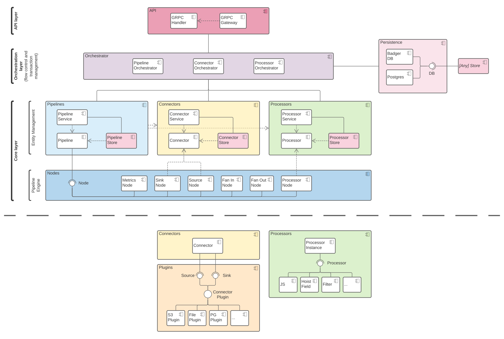

# Conduit Architecture

This document describes the Conduit architecture.

## Vocabulary

- **Pipeline** - a pipeline receives records from one or multiple source connectors, pushes them through zero or
  multiple processors until they reach one or multiple destination connectors.
- **Connector** - a connector is the internal entity that communicates with a connector plugin and either pushes records
  from the plugin into the pipeline (source connector) or the other way around (destination connector).
- **Connector plugin** - sometimes also referred to as "plugin", is an external process which communicates with Conduit
  and knows how to read/write records from/to a data source/destination (e.g. a database).
- **Processor** - a component that executes an operation on a single record that flows through the pipeline. It can
  either change the record or filter it out based on some criteria.
- **Record** - a record represents a single piece of data that flows through a pipeline (e.g. one database row).

## High level overview

Conduit is split in the following layers:
- **API layer** - exposes the public APIs used to communicate with Conduit. It exposes 2 types of APIs:
  - **gRPC** - this is the main API provided by Conduit. The gRPC API definition can be found in
    [api.proto](../proto/api/v1/api.proto), it can be used to generate code for the client.
  - **HTTP** - the HTTP API is generated using [grpc-gateway](https://github.com/grpc-ecosystem/grpc-gateway) and
    forwards the requests to the gRPC API. Conduit exposes an
    [openapi](../pkg/web/openapi/swagger-ui/api/v1/api.swagger.json) definition that describes the HTTP API, which is
    also exposed through Swagger UI on `http://localhost:8080/openapi/`.
- **Orchestration layer** - the orchestration layer is responsible for coordinating the flow of operations between the
  core services. It also takes care of transactions, making sure that changes made to specific entities are not visible
  to the outside until the whole operation succeeded. There are 3 orchestrators, each responsible for actions related
  to one of the 3 main entities - pipelines, connectors and processors.
- **Core** - we regard the core to be the combination of the entity management layer and the pipeline engine. It
  provides functionality to the orchestrator layer and does not concern itself with where requests come from and how
  single operations are combined into more complex flows.
  - **Entity management** - this layer is concerned with the creation, editing, deletion and storage of the main
    entities. You can think about this as a simple CRUD layer. It can be split up further using the main entities:
    - **Pipeline** - this is the central entity managed by the Pipeline Service that ties together all other components.
      A pipeline contains the configuration that defines how pipeline nodes should be connected together in a running
      pipeline. It has references to at least one source and one destination connector and zero or multiple processors,
      a pipeline that does not meet the criteria is regarded as incomplete and can't be started. A pipeline can be
      either running, stopped or degraded (stopped because of an error). The pipeline can only be edited if it's not in
      a running state.
    - **Connector** - a connector takes care of receiving or forwarding records to connector plugins, depending on its
      type (source or destination). It is also responsible for tracking the connector state as records flow through it.
      The Connector Service manages the creation of connectors and permanently stores them in the Connector Store. A
      connector can be configured to reference a number of processors, which will be executed only on records that are
      received from or forwarded to that specific connector.
    - **Processor** - processors are stateless components that operate on a single record and can execute arbitrary
      actions before forwarding the record to the next node in the pipeline. A processor can also choose to drop a
      record without forwarding it. They can be attached either to a connector or to a pipeline, based on that they are
      either processing only records that flow from/to a connector or all records that flow through a pipeline.
  - **Pipeline Engine** - the pipeline engine consists of nodes that can be connected together with Go channels to form
    a data pipeline.
    - **Node** - a node is a lightweight component that runs in its own goroutine and runs as long as the incoming channel
      is open. As soon as the previous node stops forwarding records and closes its out channel, the current node also
      stops running and closes its out channel. This continues down the pipeline until all records are drained and the
      pipeline gracefully stops. In case a node experiences an error all other nodes will be notified and stop running
      as soon as possible without draining the pipeline.
- **Persistence** - this layer is used directly by the orchestration layer and indirectly by the core layer (through
  stores) to persist data. It provides the functionality of creating transactions and storing, retrieving and deleting
  arbitrary data like configurations or state.
- **Plugins** - while this is not a layer in the same sense as the other layers, it is a component separate from
  everything else. It interfaces with the connector on one side and with Conduit plugins on the other and facilitates
  the communication between them. A Conduit plugin is a separate process that implements the interface defined in
  [plugins.proto](https://github.com/ConduitIO/conduit/blob/main/pkg/plugins/proto/plugins.proto) and provides the
  read/write functionality for a specific resource (e.g. a database).

## Package structure

- `cmd` - Contains main applications. The directory name for each application should match the name of the executable
  (e.g. `cmd/conduit` produces an executable called `conduit`). It is the responsibility of main applications to do 3
  things, it should not include anything else:
  1. Read the configuration (from a file, the environment or arguments).
  2. Instantiate, wire up and run internal services.
  3. Listen for signals (i.e. SIGTERM, SIGINT) and forward them to internal services to ensure a graceful shutdown
     (e.g. via a closed context).
  - `conduit` - The entrypoint for the main Conduit executable.
- `pkg` - The internal libraries and services that Conduit runs.
  - `conduit` - Defines the main runtime that ties all Conduit layers together.
  - `connector` - Code regarding connectors, including connector store, connector service, connector configurations
    and running instances.
  - `foundation` - Foundation contains reusable code. Should not contain any business logic. A few honorable mentions:
    - `assert` - Exposes common assertions for testing.
    - `cerrors` - Exposes error creation and wrapping functionality. This is the only package for errors used in Conduit.
    - `database` - Exposes functionality for storing values.
    - `log` - Exposes a logger. This is the logger used throughout Conduit.
    - `metrics` - Exposes functionality for gathering and exposing metrics.
  - `orchestrator` - Code regarding the orchestration layer.
  - `pipeline` - Code regarding pipelines, including pipeline store, pipeline service, running pipeline instances.
  - `plugin` - Currently contains all logic related to plugins as well as the plugins themselves. In the future a lot of
    this code will be extracted into separate repositories, what will be left is a plugin service that manages built-in
    and external plugins.
  - `processor` - Provides the types for processing a `Record`. A common abbreviation for transforms is `txf`.
    - `transform/txfbuiltin` - Contains built-in transforms.
    - `transform/txfjs` - Provides the functionality for implementing a transform in JavaScript.
  - `record` - Everything regarding a `Record`, that is the central entity that is pushed through a Conduit pipeline.
    This includes a record `Schema`.
  - `web` - Everything related to Conduit APIs or hosted pages like the UI or Swagger.

Other folders that don't contain Go code:

- `docs` - Documentation regarding Conduit.
- `proto` - Protobuf files (e.g. gRPC API definition).
- `test` - Contains configurations needed for integration tests.
- `ui` - A subproject containing the web UI for Conduit.
