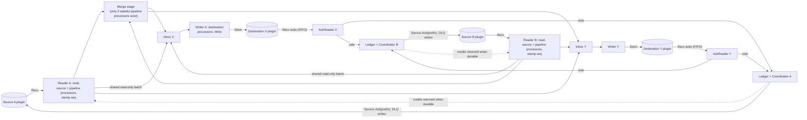
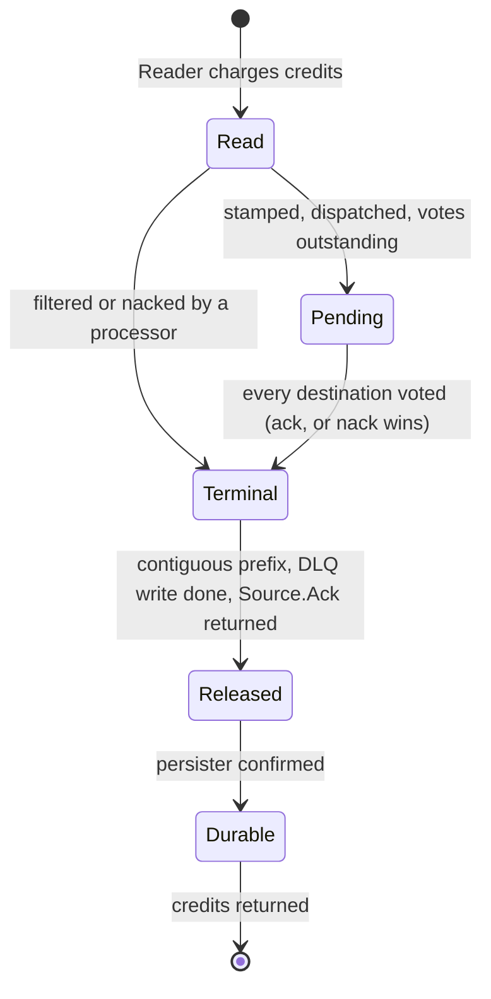

# Staged batch engine: one pipeline engine for Conduit

> **Do not merge before the v0.20.0 tag.** v0.20.0 is in its pre-tag quiet window. Milestone v0.21.0.

## Summary

Conduit ships exactly one pipeline engine. Users never choose between engines. The engine is the **staged batch
engine**: a small set of long-lived goroutines per source and per destination, joined by bounded queues, that moves
batches of records with several batches in flight at once, and releases acknowledgements to each source one position at
a time, strictly in source order.

It keeps what arch-v2 got right (batches, record flags, the split-run ledger, per-position fan-out acks, run fencing,
per-source DLQ, stop semantics) and replaces what the early measurements point at as its limit: the stop-and-wait loop
in
`funnel.Worker.Do`, which allows one batch in flight per source and, behind the shared-tail lock, one per destination.

This document is **mutable** and carries the mechanisms: stages, defaults, conditional additions, test plan, rollout.
The
**principles** (one engine, the ledger with in-order prefix release, bounded credits, invariants 1 to 7, the ordering
contract, processor placement) live in the immutable ADR
[20261009-single-pipeline-engine](../architecture-decision-records/20261009-single-pipeline-engine.md). That ADR merges
only after the prototype results and the Alternative A run are recorded here.

**Tier 1** (data path). **BREAKING CHANGE**, staged over v0.21 to v0.23. Direction approved by DeVaris on 2026-10-09 and
refined the same day after a fresh-context Tier 1 review; this document still needs sign-off before anything is built.

## Context and problem

### What exists

- **v1**, `pkg/lifecycle/stream`, the default. A node graph (source, source acker, processors, fan-in, fan-out,
  destination, destination acker) connected by channels. One record per message. Stages run on their own goroutines, so
  reads, writes and acks overlap. It honours processor `workers > 1` through `ParallelNode`
  (`pkg/lifecycle/service.go:733`, `stream/parallel.go`). It cannot run a processor that returns several records for one
  input (`pipeline.fanout_requires_arch_v2`, `stream/codes.go:31`).
- **arch-v2**, `pkg/lifecycle-poc`, opt-in with `--preview.pipeline-arch-v2`. A `funnel.Worker` per source drives a
  `TaskNode` tree one batch at a time. It supports batches, split runs, destination fan-out and N sources, ignores
  processor `workers`, and is required by the `postgres-pgvector-rag` template.

Two engines with a user-visible switch is a DX failure and a standing tax on every data-path change
([20260704-pipeline-architecture-v2](../architecture-decision-records/20260704-pipeline-architecture-v2.md) named the
tax and bounded it; it did not remove it).

### Early read (mutable; to be committed with #2956)

Non-gating, and **not in the repo yet**: AWS c7i.4xlarge (16 vCPU), main at `ce758f96`, harness from PR #2956 (open).
The
raw results are to be committed with that PR; until they are, treat these figures as unverified by the repo. Generator
source to file destination, no external I/O, default config (`sdk.batch.size=0`), records counted at the sink, 20 s
warmup
discarded, 60 s windows, 5 rounds, A/A control in the same session. Rates are records per second per sink.

| Shape | v1 (two arms) | arch-v2 | arch-v2 vs v1 | A/A floor (v1) |
| --- | --- | --- | --- | --- |
| 1x1 | 47,688 / 47,924 | 35,930 | -25.0% | +/-2.3% |
| 2x2 | 25,947 / 26,075 | 24,454 | -6.0% | +/-1.8% |

- arch-v2 against itself is stable (A/A +/-1.0% at both shapes).
- PR #2946 (open), arch-v2 2x2: +0.9% against main, A/A floor +/-1.2%, so no resolvable effect: allocation is not what
  limits throughput here.
- Per-sink rate in a 2x2 run equals the total source read rate, because every record goes to both destinations. Total
  destination writes per second are about 52k (v1 2x2), 48.9k (arch-v2 2x2), 47.7k (v1 1x1) and 35.9k (arch-v2 1x1).
  Three of four sit near 50k, which is consistent with a ceiling in the destination or sink path of this harness. It is
  an
  observation, not a finding; the profile must say whether it is real. It matters for the graduation bar.

The 6.3x allocation and 3.3x memory figures in the 20260704 ADR came from a mocked 1000-record-batch microbenchmark. At
default config the source returns batches of one. They are not what users get
([20261006-archv2-graduation-gate](../architecture-decision-records/20261006-archv2-graduation-gate.md)).

### Diagnosis: stop-and-wait (hypothesis, to be confirmed by profile)

For one source, one pass of `funnel.Worker.Do` does the following in sequence on one goroutine, and starts the next pass
only when the last step returns:

1. `Worker.Do` loops one `doTask` pass at a time (`pkg/lifecycle-poc/funnel/worker.go:287`).
2. `SourceTask.Do` blocks in `Source.Read` for the next batch (`funnel/source.go:88`).
3. Processors run on the batch.
4. `processingLock` is taken after the read and held until the batch is end-to-end done (`worker.go:615-620`).
5. With several destinations the pass forks one goroutine per branch and waits for all of them
   (`worker.go:890-894`): the slowest destination sets the pace.
6. `DestinationTask.Do` calls `Destination.Write` (`funnel/destination.go:96`), then blocks reading acks until every
   record in the batch is acked (`destination.go:101-118`).
7. Only then `Worker.Ack` calls `Source.Ack` (`worker.go:922`) and the loop reads again.

Throughput is the batch size over the sum of read, process, write, ack wait and source ack. With `sdk.batch.size=0` the
batch is one record. With N sources, `doTask` takes `taskNode.sharedMu` around the whole shared-tail pass including the
destination write and its ack wait (`worker.go:445`; `sink.go:52-56` only documents it), so a destination never has more
than one batch in flight across all sources.

v1 does not have this shape. `DestinationNode.Run` writes and hands the message to `DestinationAckerNode`, whose worker
reads acks on another goroutine (`stream/destination.go`, `destination_acker.go`), and `SourceAckerNode` releases source
acks in order through a semaphore (`source_acker.go`). The gap is largest at 1x1, where nothing else supplies
concurrency,
and shrinks at 2x2, where two workers and two branches overlap each other's waits. That fits the hypothesis; it does not
prove it.

### What this document does not claim

That the staged engine will beat v1, or any absolute number. The target is not slower than v1 beyond the A/A floor, at
lower memory. Performance statements are the early read above until the "Prototype results" section is filled in.

## Goals

1. One engine, no user-selectable mode.
2. Throughput not below v1's at 1x1, 2x2 and 4x4 within the A/A floor, lower memory, and no loss where users set
   `sdk.batch.size`; a clear win where destinations have real latency.
3. Data-integrity invariants 1 to 7 hold, each argued below and each with a named test.
4. One-to-many processors work natively, including across destination fan-out.
5. Memory bounded by credits; stalls visible and attributable.
6. No new tuning knobs. Defaults are derived.
7. Persisted position and state formats byte-compatible in both directions.
8. The documented pipeline semantics are preserved (see the flow mapping).

## Non-goals

- Engine choice. The only selector that survives is a hidden, dated fallback to v1 (v0.22 only).
- Clustering, membership, leader election, rebalancing
  ([20260704-single-node-engine](../architecture-decision-records/20260704-single-node-engine.md)).
- Flink-class state. One seam is left for the local state layer
  ([20260704-local-state-only](../architecture-decision-records/20260704-local-state-only.md)); nothing is built for it.
- A columnar representation. It stays inside `Batch` (ADR 20260823); nothing here forecloses it.
- Any change to `conduit-connector-protocol`. The engine cannot ask a source for N records (`SourceRunRequest` carries
  only
  `AckPositions`); read-side batching is `sdk.batch.*` in the source plugin plus, if the prototype justifies it,
  engine-side aggregation.
- Exactly-once. Ordering across sources. Parallelism inside one source's stream. Destination isolation (the slowest
  destination sets the pace).

## Constraints

- **Protocol is fixed.** Source: `Recv` records, `Send` ack positions. Destination: `Send` records, `Recv` acks matched
  to
  writes by order only. Concurrent `Send` and `Recv` on one stream is safe; `Send` and `Send` is not.
- **The Go SDK destination `Run` loop is serial**: `Recv`, then `writeStrategy.Write`, then the next `Recv`
  (`conduit-connector-sdk` `destination.go:187-208`). Pipelining overlaps the engine's work with the plugin's write, not
  writes with each other. A destination's rate is about records per `Write` over write latency.
- **`connector.Source.Ack` queues; the persister makes it durable.** It records `State.Position = p[len(p)-1]`, appends
  a
  pending ack and queues the persist (`pkg/connector/source.go:564-612`); the plugin ack is sent only after the
  persister
  confirms (`onPersistFlushed`, `source.go:624`). The persister flushes within `DefaultPersisterDelayThreshold` of one
  second or `DefaultPersisterBundleCountThreshold` of 10,000 changes (`pkg/connector/persister.go:29-30`).
  `Source.Teardown` flushes and delivers the final ack before closing the stream (`source.go:376`).
- **The SDK destination batcher flushes only on size, on its timer, or on `Stop`**
  (`conduit-connector-sdk` `internal/batcher.go:67-72`). A destination with `sdk.batch.size` holds records unacked until
  one of those.
- **Built-in connectors use an unbuffered in-memory stream that clones requests on `Send`**
  (`pkg/plugin/connector/builtin/stream.go`); plugin code never shares the engine's records. The AckReader must always
  be
  receiving, because the plugin's ack `Send` blocks until it is.
- **Positions are unique only within a source.** They are never keys across sources.
- **Processor instances are single-caller.** An instance is never called from two goroutines at once.
- **Public contracts** (CLAUDE.md): pipeline config, error codes, protocol, CLI flags, metrics names. Deprecation:
  announce, warn, remove after at least two minors.
- **Process.** Solo maintainer; Tier 1 needs separate-session human sign-off; the quiet window forbids merging before
  the
  v0.20.0 tag. Nearby lanes: LC (`service.go` status writes), TC (`connector/source.go`, `persister.go`), EV
  (`lifecycle-poc`
  reading `Errors()`, #2929), AV2 (#2910, #2909), GJ. The durability hook touches TC's files and is sequenced after
  them (see Credits).

## Architecture

### Flow mapping: documented semantics onto stages

The documented flow (`conduit-site` repo, `docs/0-what-is/1-core-concepts/1-pipeline-semantics.mdx`) is: sources, source
processors, fan-in, pipeline processors, fan-out, destination processors, destinations. The architecture page documents
processors as "stateless components that operate on a single record". Each section maps 1:1 onto a stage:

| Documented section | Staged engine | Instances |
| --- | --- | --- |
| Source connector | Reader (the only caller of `Source.Read`) | 1 per source |
| Source processors | Run in that source's path, inline after the read | 1 per processor per source |
| Fan-in | No node. Each source path dispatches into destination inboxes; the inbox is FIFO by arrival, so per-source order is kept and cross-source order is unspecified, as documented | none |
| Pipeline processors declared `stateless` | Run in each source's path after the source processors, **one instance per source**, in parallel across sources; optionally on a worker pool within the source (below) | N per processor, times `workers` |
| Pipeline processors not declared stateless (the default for anything undeclared) | Run on a serial **merge stage** after fan-in, one instance. The chain is split at the first such processor: it and everything after it run on the merge stage; everything before runs per source | 1 per processor |
| Fan-out | Dispatch of one shared read-only batch to M inboxes. Bounded by the credit window instead of unbuffered channels | none |
| Destination processors | Run in the destination's writer, before `Write` | 1 per processor per destination |
| Destination connector | Writer (only caller of `Write`) and AckReader (only caller of `Ack`) | 1 each per destination |

Documented semantics kept: per-source order; no cross-source order; a source record is acked only after every
destination has durably handled it; the speed of the slowest destination dictates the pipeline's speed (backpressure).
One documented sentence changes: the fan-out node "does not buffer messages". The staged engine buffers up to the credit
window; the site page must say so.

**Processor model.** Parallelism is opt-in and proven, never assumed. A processor runs in parallel only if it is
**declared `stateless`**: in a built-in, only after the statelessness audit and its test prove it; in a standalone
processor, only if its author declares the `stateless` field in the versioned processor spec
(`conduit-processor-sdk`). Anything undeclared is treated as **stateful** and runs once, on the serial merge stage, as
after v1's fan-in. A declared-stateless pipeline-level processor gets one instance per source, in that source's path,
and
may additionally run on a worker pool within the source (next section). Per-source order is unchanged and the
cross-source guarantee (none) is unchanged. This replaces v1's `workers > 1`, which arch-v2 ignores. Examples of
stateful:
the labs aggregate processor, future state-layer processors.
Destination processors stay in the writer, one instance, and a branch copies the batch only if it has a non-destination
task.

### Shape



When pipeline processors not declared stateless exist, sources dispatch to the merge stage instead of directly to the
inboxes.

Life of one **position** in the ledger (release is per position, not per batch):



### Baseline and conditional additions

The baseline is the smallest engine that removes stop-and-wait. Everything else is added only if the prototype shows the
stated need, and each addition is a separate slice with its own evidence.

| Piece | In the baseline | Added only if the prototype shows |
| --- | --- | --- |
| Reader that reads, runs processors inline, stamps a sequence number and dispatches | Yes | |
| Separate runner goroutine (read overlaps processing) | No | Profile shows the reader blocked behind processors while credits are free, and the RAG-shaped run gains more than the A/A floor |
| Aggregation and linger of small reads into larger batches | No | At default config the per-pass fixed cost (about 1,190 ns and 9 allocs, #2754) or per-`Write` overhead costs more than the floor against the same pipeline with `sdk.batch.size` set |
| Writer coalescing of small batches into larger `Write`s | No | A latency-injected shape shows records per `Write` limiting the rate (rate is about records per `Write` over write latency) at default config |
| Byte credits and a size estimator | No; credits are in records only | A large-record shape exceeds the memory target with record credits alone. Until then the memory bound is in records, not bytes, and the document says so |
| Persister flush when the reader is starved of credits | Yes (see Credits) | |
| Reader/runner split, linger, coalescing, byte credits | n/a | each is one row above; none ships on argument alone |

### Components (baseline)

**Reader** (one goroutine per source). The only caller of `Source.Read`. Waits for free credits, calls `Read`, charges
  the
actual size, takes the batch through the source's processors and then the per-source pipeline processors (to completion,
including every `Retry` re-run and every split), stamps a per-source sequence number, registers the positions in the
ledger, and dispatches. `io.EOF` means the source is exhausted and arms a graceful stop for that source only, as today
(`worker.go:543-590`).

**Merge stage** (one goroutine per pipeline, only if pipeline processors not declared stateless exist). Takes batches
  from all sources
in arrival order and runs the first not-declared-stateless processor and everything after it in the chain.

**Dispatch.** The batch is shared read-only with every destination inbox, reference counted, in sequence order per
  source.
Per-branch state is not shared: each branch has its own record statuses and its own copy of the run table (below).
Records are shared for a branch made only of the destination task and copied (`Batch.clone()`) for a branch with any
other task. PR #2946 (open) proposes the allow-list `branchMutatesRecords` for this; until it merges, main copies for
every branch, and this design does not depend on that PR.

**Inbox** (one per destination). A bounded FIFO of batch references, merging all sources by arrival.

**Writer** (one goroutine per destination). The only caller of `Destination.Write`. Takes batches from the inbox in FIFO
order and applies the destination's processors. Records that a destination processor **filters or nacks never reach the
plugin and will never be acked by it, so the writer itself casts those votes** (filtered counts as handled; a nack
carries
the error). It then appends an expected-ack entry to the in-flight FIFO **before** calling `Write`, and calls `Write`
with the remaining records. It does not wait for acks. It blocks only when the unacked window is full or the transport
applies backpressure.

**AckReader** (one goroutine per destination). The only caller of `Destination.Ack`. Matches each ack to the head of the
in-flight FIFO by order. **Ack mismatch check (stated once):** the position bytes of every ack must equal the position
of
the record it is matched to; any difference, surplus ack, ack with nothing outstanding or duplicate is a protocol
violation and is fatal (see Failure modes). It never blocks on a coordinator, DLQ or source, and is the single consumer
of its ack stream by construction, which removes the cross-worker ack-desync class that `TaskNode.poisoned` contains
today
(`worker.go:445-500`).

**Ledger and coordinator** (a mutex-guarded ledger plus one goroutine per source). See "Release granularity".

### Release granularity: positions, not batches

The ledger is keyed by position. A batch sequence number only addresses entries and orders dispatch. Release is
**position-level**, which is required by two cases batch-level release cannot express:

- **DLQ failure.** If the DLQ write for position j in the middle of a batch fails, positions before j are released and
  j is not. A batch-level release would either ack j or hold back j-1.
- **Split runs.** A run's original position is terminal only when every piece is terminal at every destination. Other
  positions of the same batch can be terminal earlier.

Per position the ledger holds the vote count outstanding, a nack (error, task id) if any, and whether it is filtered. A
position is terminal when every destination has voted ack, or any has voted nack (nack wins, as in
[20260731-archv2-fanout-ack-model](../architecture-decision-records/20260731-archv2-fanout-ack-model.md)), or a
processor
filtered it. The AckReader and writer record votes under the ledger mutex and signal the coordinator on a one-slot
channel.
The coordinator wakes, takes the longest contiguous run of terminal positions starting at the oldest unreleased one (it
may
end mid-batch) and, outside the mutex: for each nacked position writes to the source's DLQ in order, stopping at the
first
failed write; then calls `Source.Ack` once with the positions it has handled; then marks them released. The mutex is
never
held across I/O. A failed `Source.Ack` or DLQ write stops release permanently (v1's `SourceAckerNode.fail`).

Credits, bytes and the replay bound are tracked per position, so a partly released batch returns partly.

### Credits and durability

Credits bound the positions a source may have **read but not yet durably persisted**. They return only when the
position is
durable, **not** when `Source.Ack` queues it. That is deliberate:

- It makes the replay bound exact: after a crash, at most one credit window per source is re-read (plus one read
  overshoot),
  because everything past the window is, by construction, already durable.
- It bounds `pendingAcks` and the deferred-ack delivery queue in `connector.Source`, which are otherwise unbounded while
  the persister lags (`source.go:593-612`).

Mechanics. The reader waits for free credits before reading and charges what it got, so memory overshoots by at most one
read response. A single batch larger than the whole window is admitted when nothing else is in flight. Durability is
learned from `connector.Source`: it needs a small additive hook, a callback per `Ack` (or a durable watermark) fired
from
`onPersistFlushed`. The callback must not block: it posts to the ledger and signals the reader. That hook touches
`pkg/connector/source.go`, the TC lane's file. **Sequencing:** it lands in v0.21, after #2947 and #2950 (v0.20.1)
merge, so there is no ownership conflict.

Persister lag is now inside the credit loop (up to the one-second debounce). So when the reader is blocked waiting for
credits while released-but-not-durable positions exist, the engine asks the persister to flush
(`Persister.Flush`, `persister.go:328`), at most once per flush round trip. This is part of the baseline because
without it
the window would have to cover a full second of throughput. It adds no setting.

**Starting values and their derivation.** These are for the prototype to validate, not final.

- **Unacked window per destination** `U` = records written and not yet acked. It must cover the records the plugin holds
  at once: one `Write` in flight, one being handed over, and anything the SDK batcher holds. So
  `U = max(4,000, 2 x destination sdk.batch.size)` records. The factor of two lets one batch fill while another flushes.
  4,000 is about four of the 1,000-record write sizes arch-v2 was benchmarked with.
- **Credit window per source** `W` = records read and not yet durable. It must cover `U` plus the
  released-but-not-durable
  tail: `W >= rate x (write latency + ack latency + persist latency)`. With starvation flushes the persist term is one
  persister round trip rather than one second. Starting value `W = 2 x max(U)`, at least 8,000 records. At 50k records/s
  this tolerates about 160 ms of combined latency; at 8,000 records it bounds the post-crash replay to 8,000 records per
  source.
- A destination with `sdk.batch.size` larger than half `U` raises `U` (derived, not configured), and pipeline start
  warns
  when the derived window grows past the default.

**Sizing, corrected.** The SDK destination loop is serial, so pipelining does not make writes overlap. Per destination,
rate is about `R / L` for `R` records per `Write` and write latency `L`; stop-and-wait gives `R / (L + E)` where `E` is
the
engine's serial time (read, process, source ack, persist wait). Pipelining removes `E` from the loop. Raising `R`
(batching, coalescing) is the only lever on `L`. Both matter; neither is claimed to be sufficient alone.

### Lifecycle

**Start.** Open the shared sink (destinations, pipeline processors not declared stateless) before any worker. Start the
  stages.

**Graceful stop** (user `Stop`, `StopAll`, SIGTERM). The stop request is recorded before anything is told to stop, per
[20261007-stop-requested-never-recovers](../architecture-decision-records/20261007-stop-requested-never-recovers.md).
The
order is v1's, because the destination SDK batcher flushes only on `Stop` or its timer:

1. **Stop reading.** `Source.Stop` returns the last position the plugin will emit; the reader reads until it has seen it
   (`stream/source.go:221-244`). **These stop-time reads ignore credits.** The overshoot is bounded: the SDK's `Stop`
   waits
   for the plugin's read loop to finish (`conduit-connector-sdk` `source.go:376-383`), and the built-in stream is
   unbuffered, so at most one read response is outstanding; for standalone plugins it is what the plugin has already
   emitted. The funnel `Source` interface has no `Stop` and tears the source down instead (`funnel/source.go:36-47`),
   which fails `Source.Ack` once batches are in flight; that path is not used.
2. **Finish dispatch.** The reader completes the batch it holds. Writers drain their inboxes.
3. **Flush destinations first.** Once a destination can receive nothing more (all sources finished, inbox empty), the
   writer calls `Destination.Stop(ctx, lastWrittenPosition)` **before** waiting for acks, as v1 does
   (`stream/destination.go:84-90`). That is what flushes a batching destination. The stream stays open; the flushed
   records are acked afterwards.
4. **Wait for acks and durability.** AckReaders keep reading until the in-flight FIFO is empty; the coordinator releases
   everything; wait for the final persist. Bounded by the stop deadline (`DefaultStopAndWaitTimeout`, 30 s, for
   `StopAndWait`; the runtime exit timeout for shutdown).
5. **Teardown.** `Source.Teardown` (flush, final ack), then close the sink after every worker has exited.
6. **Deadline passed.** Take the force path. The result is `UserStopped` or `SystemStopped` with the error recorded and
   is
   never recovered.

`StopAndWait` and `ReconfigureProcessor` keep the contract in
[20260731-archv2-drain-reconfigure](20260731-archv2-drain-reconfigure.md): bounded drain,
`lifecycle_v2.stop_and_wait_timeout`
on timeout without killing anything, and `ReconfigureProcessor` refusing with `ErrProcessorNotLiveReconfigurable`. The
drain now includes in-flight positions and the destination flush.

**Force stop and stage errors.** Cancel the pipeline context; every blocking wait selects on it. Cancellation and
  transport
errors cast no votes. Nothing past the released prefix is acked. The tail replays.

### Concurrency model and goroutine budget

Engine-owned goroutines per pipeline: 2 per source (reader, coordinator), 2 per destination (writer, AckReader), 1 merge
stage if pipeline processors not declared stateless exist, plus the supervisor that exists today: `2N + 2M + 1 (+1)`.
Optional
additions
from the table above (runner, aggregation) would add up to one per source, and each worker pool adds `workers` plus one.

Goroutines owned by the connectors are the same under any engine and are listed separately so comparisons are like for
like: one deferred-ack delivery goroutine per source (`connector/source.go:291`), the persister's callback goroutines
(`persister.go:406,411`), and a persist-error watcher per connector, which the engine must run to surface persister
failures (the EV lane, #2929). In v1 the equivalent watchers are the trigger helpers.

For comparison, v1 runs a goroutine per node plus up to two trigger helper goroutines per publisher/subscriber node
(`stream/base.go:153,174`) and an acker worker per destination; arch-v2 runs N workers plus up to M branch goroutines
per
pass (`worker.go:890`), so up to N x M transient goroutines. Exact counts for each engine at 1x1, 2x2 and 4x4 are
measured
in the prototype and recorded in "Prototype results"; they are not asserted here.

Rules:

- One ledger mutex per source, held only for in-memory updates. It is the only lock on the data path.
- Everything else is a bounded queue or a one-slot signal. No lock is held across `Read`, `Write`, `Ack`, `Source.Ack`,
  a DLQ write, a processor call or a channel send.
- Each plugin stream direction has exactly one goroutine. Each processor instance is called from exactly one goroutine.

Deadlock freedom. The data flow is a cycle (credits return to the reader) but the waits are not. Reader waits on
credits;
credits wait on the persister and the coordinator; the coordinator waits on votes and on I/O to source and DLQ; votes
wait
on AckReaders and writers; AckReaders wait only on their destination plugin; writers wait on the unacked window (freed
by
AckReaders) and the plugin; readers also wait on inbox space (freed by writers). Nothing waits on a later stage except
through a bounded resource that the earlier stage's progress does not depend on. The one self-dependency, a batch
waiting
for credits it needs itself, is handled by admitting an over-window batch when nothing else is in flight.

## Invariants

Each is stated, then argued for this design. Enforcement sites carry `// Invariant N:` comments in the implementation,
and each has a test that fails if the line is removed.

**1. Never acknowledge a record upstream before it is durably handled downstream.** `Source.Ack` is called from exactly
one place, the coordinator's release. A position enters a release only if the ledger holds a terminal disposition for
it:
acked by every destination, filtered by a processor, or written to the DLQ with the write confirmed. A destination vote
comes from exactly two places: the AckReader, from an explicit positive ack matched to a write; and the **writer**, for
records a destination processor filtered or nacked (no plugin ack exists for them). Cancellation, timeouts, transport
errors and protocol violations cast no votes. Pipelining adds no new way to ack early, because a plugin vote still
arrives
only when the destination acks the write. `Source.Ack` defers the plugin ack until durable (existing). Credits are not
acks. Tests: `TestStaged_NoAckBeforeAllVotes` (early-ack mutation fails it, and the SIGKILL gap check);
`TestStaged_DestProcessorFilterVotes` (a destination processor filters or nacks records in the middle of a write; the
position is released exactly when the other records are acked, and a nack reaches the DLQ).

**2. Positions and offsets are monotonic and crash-safe.** The coordinator is the only writer of source position and
releases in ascending position order, one goroutine per source. Releases are contiguous, so the positions handed to
`Source.Ack` are the source's own order with no gaps. After a failed `Source.Ack` or DLQ write nothing further is
released. Empty and duplicate positions are rejected at dispatch with the existing coded errors; positions are outputs,
never keys. A split run contributes only its original position, never the nil positions of its tail pieces
(`batch.go:310`).
The persisted format is untouched: `SourceState{Position}` through the existing persister.

**3. At-least-once is the floor.** Every record read is either unreleased (it will replay) or released with a terminal
disposition. No bounded queue drops; they block. Error, shutdown and cancel paths release at most the contiguous
terminal
prefix and replay the rest. A DLQ failure releases the positions up to the last confirmed DLQ write, then fails the
pipeline (position-level release makes this exact). There are no rebalances in a single-node engine.

**4. Ordering guarantees are per source and documented.** See the contract below. This is the invariant most affected,
  so
it needs explicit sign-off.

**5. State and checkpoint writes are atomic.** This engine adds no durable state. For the future state layer the seam is
the coordinator's release: a keyed stage would expose a checkpoint for exactly the released prefix, written in the same
persister batch as the position. Nothing is built now; every future state feature ships its kill-mid-write test (the
store-fault harness, `tests/chaos/store_fault.go`, is reused).

**6. Schema handling never silently mangles data.** The engine moves records by reference and neither reads nor rewrites
payloads. A type problem is a nack to the DLQ or a pipeline error, never a drop. The only mutation points are
processors.

**7. Shutdown is graceful by default; `kill -9` is recoverable.** Graceful stop is the ordered drain above. A SIGKILL
  leaves
only disposable in-memory state; resume is from the persisted position and replays at most one credit window per source.

## Ordering semantics (contract)

1. **Per source, per destination, total order.** The records a destination first receives from one source arrive in the
   order that source produced them: across batches, through filters, splits and DLQ removals (a removed record leaves a
   gap, never a swap). Stronger than per-partition order.
2. **Nothing across sources.** FIFO by arrival at an inbox is an implementation behaviour, not a promise. This holds for
   per-source pipeline-processor instances and for the merge stage alike.
3. **Splits are contiguous.** The pieces of one input record reach a destination adjacent, in order, at the input
   record's place.
4. **Redelivery is repetition, not reordering.** After a crash the replay starts at the persisted position and keeps
   rule 1
   for itself.
5. **DLQ.** Each source's DLQ receives its nacked records in source order.

Mechanism: one goroutine dispatches each source's batches in order to every inbox; FIFO inboxes; one writer per
destination taking FIFO; an ordered stream; FIFO ack matching; release in position order. A worker pool for a stateless
processor reassembles in sequence order before anything is dispatched.

## One-to-many processors and split runs

The RAG template (`postgres-pgvector-rag`: source, `ai.chunk`, `ai.embed`, pgvector) depends on a processor returning
several records for one input, so the single engine runs them natively.

- `Batch.SplitRecord`, the record flags and the split-run ledger (`run_ledger.go`) are reused. A run's original
  position is
  released only when every piece is terminal
  ([20260801-archv2-split-run-ack-ledger](20260801-archv2-split-run-ack-ledger.md)).
- **A stage completes its batch before it emits.** The reader finishes every `Retry` re-run and split, within the
  existing
  bounds (`maxRetryAttempts`, `maxRetryStall`, `pipeline.retry_not_converging`), before dispatch. No batch leaves a
  stage
  holding part of a run, so destination fan-out never sees a straddling run. This removes the failure
  `pipeline.split_run_straddles_fanout` still reports on main, without the defer buffer of
  [20260801-archv2-run-join-defer-fanout](20260801-archv2-run-join-defer-fanout.md), which is not implemented on main.
- **Per-destination run metadata.** `Batch.runs[]` holds pointers to mutable `*splitRun` counters shared by every piece
  (`batch.go:63-80`). Branches diverge, so each destination branch gets its own copy of the run table at dispatch, even
  when
  its records are shared read-only (today's `cloneRuns`, allocated lazily when runs exist). A run's terminal count is
  therefore per destination, and a destination votes once per original position when its own count completes (nack wins
  inside the run).
- **Destination processors that split** do so in the writer. A run can then span several `Write`s (the writer chunks to
  the
  write size) and several ack chunks. The in-flight FIFO entry for each piece carries `(seq, original index, run)`;
  mapping is never recovered from ack bytes. Tail pieces carry a nil bookkeeping position (`batch.go:310`) and their
  record
  positions may repeat the original's, so the ack-bytes check compares against the written record's own position while
  identity comes from FIFO order.
- **Amplification and credits.** Credits are charged on records as read. A processor that amplifies charges the growth
  to
  the same source's credits and may block for them; if the batch is the oldest in flight it proceeds. (With records-only
  credits the growth is counted in records.)
- **DLQ.** A nacked piece nacks the original record. The DLQ receives the record as it stood immediately before the
  first
  split of its run (including earlier processors' changes), not the raw source record; a record nacked without a split
  is
  written as it stood at the nack.
- The `rag-e2e` required check is the end-to-end gate.

## Stateless processors: instances and the worker pool

Two ways of running several instances of a declared-stateless processor, one mechanism: N instances whose outputs are
merged in order.

- **Per source.** One instance per source path. Outputs are merged by arrival at the inbox: no cross-source order.
- **Within a source (the worker pool).** `workers` instances serve one source path, and outputs are merged **by sequence
  number**, so per-source order is exactly preserved. This fully replaces v1's `ParallelNode`
  (`pkg/lifecycle/stream/parallel.go`) and its coordinator that collects results in dispatch order.

Specification of the pool:

- **Size** is the processor's existing `workers` setting, default 1. No new knob. With `workers = 1` there is no pool
  and
  the processor runs inline in the reader, as in the baseline. With `workers > 1` the pool is a stage: the reader hands
  stamped batches to it and does not wait (this is the case in which the reader/runner split of the baseline table
  becomes
  required, for that processor only). Each worker owns its own processor instance, so the single-caller rule holds. A
  pipeline-level processor with `workers = w` in an N-source pipeline therefore has `N x w` instances.
- **Unit of work** is a whole batch, never a fragment of a split run. A worker runs the processor step for its batch to
  completion, including every `Retry` re-run and every split, on its own instance. Split runs and `Retry` therefore
  never
  cross workers, the run table stays per batch, and a batch leaves the pool with every run whole, as the one-to-many
  section requires.
- **Ordered reassembly.** One emitter per pool releases batch results strictly in sequence order. A result that finishes
  early waits in a reorder buffer. The pool accepts new batches only while the sequence is within `2 x workers` of the
  next
  one to emit, so the buffer is bounded by the pool, and credits bound it again.
- **Credits.** A batch holds its credits from the read until its positions are durable, including while it sits in the
  pool
  or the reorder buffer. Amplification growth is charged at ordered emit, oldest first. That keeps the "oldest in flight
  always proceeds" rule intact: a later completed batch never holds credits the oldest batch needs to emit.
- **Failure.** A processor error that fails the batch (an error returned or a panic in a worker, as opposed to a
  per-record nack, which flows through in order like any nack) **cancels the pipeline context without acking that
  batch**.
  Batches already emitted before it keep their normal fate and the released prefix may include them; the failing batch,
  every later batch in the pool and everything in the reorder buffer are discarded unacked and replay. No result is
  emitted
  out of order on the way out. Recovery follows the existing classification.
- **Stop.** Graceful stop drains the pool before the destination flush, like any in-flight batch.
- **Goroutines.** A pool with `workers > 1` adds `workers` plus one emitter.
- **Tests (new).** Property: for random per-batch processing delays, output order equals input order and nothing is
  lost;
  a worker error at any point acks nothing from that batch and replays the rest; `Retry` and split runs processed on
  different workers still yield whole runs in order; a differential test of the pool against v1's `ParallelNode` on the
  same
  input. The v0.22 flip is gated on the pool (graduation bar).

## Failure modes

Tests are planned names unless stated; none exist yet.

| Failure | Detection | Behaviour | Invariants | Test |
| --- | --- | --- | --- | --- |
| Crash (SIGKILL) with k positions in flight | Process death; the next boot restarts from the persisted position | In-memory state is lost. Position is the last durable release. Everything read but not durable replays, whether or not a destination wrote it: duplicates up to one credit window per source, never a gap | 1, 2, 3, 7 | `tests/chaos` `TestStagedSIGKILL_KInFlight`, k in {1, 2, 4, 16, window}; kill points: after Write before ack, after destination ack before release, between DLQ write and `Source.Ack`, after `Source.Ack` before persist, mid-persist. Assert gapless, monotonic, duplicates at most the window |
| Destination stall (stream open, no acks) | Unacked window full; stall reason `writer: unacked window full (destination X)` in the log; queue depth gauge | Writer blocks, inbox fills, readers block on inbox space and then credits; every source of the pipeline pauses. Nothing dropped; memory flat. No automatic timeout (open question) | 3 | Stalled-destination fake: reads stop within the window; memory plateaus; resumes on first ack |
| One of M destinations slower | Queue depths diverge; stall reason names it | Pace follows the slowest; the fast one idles (as v1 fan-out and the funnel's `p.Wait()`) | 1, 3 | NxM shape with an injected-latency destination; no unbounded growth |
| Nack mid-prefix (position i of batch k nacked while k-1 is incomplete and k+1 is terminal) | Error ack from a destination, or a processor nack | Ledger marks the position nacked (nack wins). Later terminal positions wait. When release reaches it the coordinator writes the DLQ, then includes it in the release. DLQ window and threshold are evaluated in source order | 1, 3, 4 | Property: random nack sets and orders; DLQ gets exactly the nacked set once; releases gapless; nothing released past an unresolved earlier position |
| DLQ failure (write error or nack threshold) | DLQ write error or fatal from `DLQ.Nack` | Fatal, not recoverable (a retry loop would rewrite the DLQ forever, as `Worker.Nack` documents). Release up to the last confirmed DLQ write, which can be mid-batch, nothing past it. Pipeline `Degraded` | 1, 3 | DLQ fake failing at position j inside a batch: released prefix ends at j-1; restart resumes at j |
| Persister failure | Connector `Errors()`; `Source.Ack` error; log `failed to persist connector batch` | Pipeline error, `Degraded`, like v1 (arch-v2 today stays `Running`; this changes it). Depends on EV #2929. The plugin ack is withheld by `connector.Source`; positions that never became durable never return credits, so reading stops at the window | 1, 3 | Store-fault harness against the engine |
| Stop during drain | Stop request recorded; deadline | Ordered drain (see Lifecycle), destination flushed before the ack wait; at the deadline the force path; status per ADR 20261007 | 1, 7 | Stop with k in flight and a batching destination (records buffered in the SDK batcher are flushed and acked); stalled destination (deadline); stop racing a transient error (no restart) |
| Force stop | `Stop(force)`, `StopAll(force)`, deadline | Cancel the context. Cancelled calls cast no votes; no `Source.Ack` after cancel except an optional best-effort release of an already-terminal prefix. `Source.Teardown` flushes; the tail replays | 1, 3, 7 | Extend existing force-stop tests; chaos force stop with k in flight |
| Plugin crash (source or destination) | `Read`, `Recv` or `Send` error; stream closed (`io.EOF`); process exit; **a destination closing its ack stream with writes outstanding** | Classified as a **plugin crash** (transient): stage error, cancel, replay, backoff recovery per 20240812. EOF with writes outstanding is a crash, not a violation, because a closed stream carries no evidence of a wrong ack. The closed-stream `io.EOF` never masks a root cause (#1659) | 1, 3 | Kill the destination plugin with k in flight, and close its stream cleanly with writes outstanding; kill the source plugin; recovery, no gap |
| Ack protocol violation | The AckReader's mismatch check (defined once under Components): wrong position, surplus ack, ack with nothing outstanding, duplicate ack | New fatal code `pipeline.ack_protocol_violation` naming the destination and the expected and received positions. The AckReader casts no vote for the violating ack and stops; earlier votes stand. Fatal because a destination that acks the wrong record cannot be trusted and a restart reproduces it | 1 | Fake destination injecting each violation; `FuzzAckReader` |
| Memory pressure | Positions in flight versus window; Go heap; oversize record; amplification | Credits bound resident positions (records; bytes only if byte credits are added); oversize batch admitted only when alone; amplification charged to credits; no shedding. An OS kill is the SIGKILL row | 3, 7 | Large-record and amplification soak; 24 h leak check |
| Internal accounting bug (double vote, vote for a released position, gap) | Ledger assertions (as `splitRun.complete` today) | Fatal coded error; nothing released past the inconsistency | 1, 2 | Property tests drive illegal vote sequences |

## Backpressure and memory bounds

The chain: destination slow, unacked window full, writer blocks, inbox fills, dispatching readers block, credits
exhaust,
the reader stops calling `Recv`. Past that point the source plugin's own buffering applies (gRPC flow control, the SDK
read
loop); that memory is the plugin's.

Resident engine memory per pipeline, worst case, in records:

```text
sum over sources of (W + one read response)
  + sum over destination branches with non-destination tasks of U     // copies
  + amplification, charged to credits
```

Shared batches are not copied per destination, so M does not multiply the first term (once #2946 or equivalent lands; on
main every branch copies today). The oversize-batch and amplification rules are where the bound is soft. **The bound is
in
records, not bytes**, until byte credits are added on evidence (table above); a pipeline of very large records can
exceed
a byte budget under the baseline, and the large-record soak exists to find where.

## Observability

The first release ships only what is needed to diagnose a stall:

- **Queue depth.** One gauge family, `conduit_stage_queue_depth`, labelled by pipeline, component id and stage (inbox,
  unacked, in-flight positions, credits available).
- **Stall reason.** Each blocking wait site records `(component, reason, blocked_on, since)` in an atomic. Transitions
  are
  logged at info, with the reason: `waiting_for_credits`, `inbox_full`, `unacked_window_full`, `dlq_write`,
  `source_ack`,
  `persister`, `processor`. `blocked_on` follows the wait chain: a reader waiting for credits names the destinations
  that
  have not voted for the oldest incomplete position. An in-process snapshot of the same data is available to tests.

Nothing else is public in v0.21. No new `flow` field in `pipelines inspect` or `--json`, no ack-lag histogram, no stall
counters; each waits until the queue-depth gauge and the log have proven insufficient (see Future work). Stage start and
stop log at debug; every fatal carries its code.

**Metrics parity.** Existing names and labels are kept. Values are made to match v1's meaning, once per record.

| Metric | v1 | arch-v2 (main) | Staged engine |
| --- | --- | --- | --- |
| `conduit_pipeline_execution_duration_seconds` | per record, read to source node (`stream/source.go:187`) | per record, from read time (`worker.go:1036`) | per record, read to release |
| `conduit_connector_execution_duration_seconds` | source: per record; destination: per record, duration of the write call (`stream/destination.go`) | observed on read (`SourceTask.Do`) and on ack (`DestinationTask.Do`), averaged per batch, from a goroutine per call | source: per record at read; destination: per record, write call duration. One observation each, no goroutine per call |
| `conduit_connector_bytes` | per record | per batch; skipped with `--preview.pipeline-arch-v2-disable-metrics` | per batch, from the same sizes; same flag until it is retired |
| `conduit_processor_execution_duration_seconds` | per record (`stream/processor.go:145`) | batch time divided by record count, one update per record from a goroutine per call (`processor_metrics.go`) | batch time divided by record count; no goroutine per call |
| `conduit_dlq_execution_duration_seconds`, `conduit_dlq_bytes` | per DLQ write (`stream/dlq.go:184`) | `dlq_metrics.go` | per DLQ write, observed by the coordinator |
| `conduit_pipeline_status`, inspector metrics | unchanged | unchanged | unchanged |

A parity test drives the same input through v1 and the staged engine and compares counts and units per series.

**Runbooks** (written with the implementation, under `docs/operations/`): `pipeline-stalled.md` (one section per stall
reason), `engine-fallback.md` (the dated v1 fallback), and updates to `connector-state-write-failures.md`.

## Security

- The plugin boundary is unchanged: gRPC and in-memory streams, WASM for standalone processors. The WASM host egress
  policy
  is untouched; the engine does not call out.
- The surface shrinks: one engine instead of two; no `sharedMu` or `poisoned` machinery; one reader per ack stream by
  construction; no per-pass goroutine fan-out; v1's node graph is deleted.
- New surface and its cover: the ack-stream parser (fuzzed; every violation fails closed), credit accounting (the engine
  measures sizes itself), and the durability hook (additive).
- Memory exhaustion by a hostile source is bounded by credits at the engine; the reader stops calling `Recv`, so flow
  control holds the connector back. N instances of a pipeline processor multiply its resource use, which operators
  should
  see as a capacity change (below).
- The hidden fallback selects an existing, shipped engine and adds no capability.

## Alternatives

### A. Keep arch-v2 stop-and-wait and tune batch size (provisional; rejected only if measurement shows it)

Fixed per-pass cost is real (`BenchmarkEnginePass`: 1,847 ns and 14 allocs per record at batch 1, 654 ns and 5 at batch
1000, #2754), and larger batches amortise it. Reading the harness's retracted 2x2-batched shape suggests batching helps,
but no valid A/A-controlled run of **batched** arch-v2 against **batched** v1 exists. A batch does not remove the serial
round trip: throughput stays batch size over the sum of stages. Bigger batches also cost latency, memory and a larger
duplicate window, and the shared-tail lock remains.

This alternative is rejected only if the Alternative A run shows it: on the AWS harness, same session, arch-v2 and v1
each
with `sdk.batch.size` and `sdk.batch.delay` set (source and destination), at 1x1, 2x2 and a latency-injected
destination,
with A/A floors. If batched arch-v2 is within the floor of batched v1 at those shapes, the case for the rewrite weakens
to
the processor-parallelism and one-engine arguments and this design is reassessed. The ADR merges only after that run is
reported under "Prototype results".

### B. Batch messages inside v1's node graph

Evaluated without an allocation argument (per-record allocation is measured only in a microbenchmark and is not what
limited the end-to-end read). On the merits: v1 already pipelines, so it keeps the best overlap, and batching inside it
could be done incrementally. But `Message` carries one record, one context and ack handlers, and every node (source,
source acker, processors, fan-in, fan-out, destination, destination acker, DLQ) assumes one record per message. Making
them batch-aware touches essentially all of `pkg/lifecycle/stream` (about 3,500 non-test lines) plus
`pkg/lifecycle/service.go` (1,366 lines), against about 3,800 non-test lines in `pkg/lifecycle-poc/funnel`: the same
order
of work, inside a structure with a goroutine and channel hop per node and an unbounded queue in `DestinationAckerNode`.
It would also need split-run support added to v1 for the RAG template. Lost on cost, not on principle.

### B'. Batch only at the source and destination nodes of v1

The smallest change: keep per-record messages inside the graph, make the destination node collect messages into larger
`Write`s (acks fan back out per message), and let the source node pass through whatever the plugin returns. It lifts
`R` in `R / L` for slow destinations at low risk and keeps v1's overlap. It does not give processors batches, and
**batching processor calls is itself a driver** (the embedding processors call provider APIs per call; one record per
  call
multiplies cost and latency), it does not support one-to-many processors, and per-message overhead stays.
Lost because it cannot deliver processor batching or the RAG template. It is the **fallback plan** if the prototype
shows
the bottleneck is below the engine, and it composes with B.

### C. Keep two engines with a user choice

No design effort, but every Tier 1 change is reasoned about, tested and fixed twice (H1, H2 and the bugs behind
issues #2722, #2723, #2728 and #2729 are engine-specific). Behaviour already differs by engine (persister failure,
one-to-many processors, processor
`workers`). Users cannot choose well: a valid cross-engine number took weeks (#2748). Docs, support and the test matrix
double. Lost on DX and cost.

### D. Kafka Connect task model: one thread per connector

A source task polls and hands records to a producer asynchronously, committing offsets on a timer after a producer flush
(`offset.flush.interval.ms`, 60 s by default); a sink task `put`s and `flush`es before committing. Offset commit is a
periodic stop-the-world barrier assuming one Kafka sink, so duplicates can span the whole interval; Conduit acks per
position to arbitrary destinations with N x M fan-out. A synchronous `put` per task is stop-and-wait again, and the
worker-cluster weight is what
[20260704-single-node-engine](../architecture-decision-records/20260704-single-node-engine.md) rejects. We keep a small
fixed set of goroutines per connector with bounded handoff and keep per-position acks.

### Design choices inside the chosen architecture

- **Mutex-guarded ledger plus a coordinator goroutine**, not inline in the AckReader (a slow DLQ or `Source.Ack` would
  stall a destination's ack reading and couple sources) and not an event channel (unbounded or deadlock-prone).
- **Position-level release**, not batch-level, because DLQ failure and split runs need it.
- **Per-position tally, not a per-batch counter** (a per-batch counter cannot represent divergence between
  destinations).
- **Credits return on durable persistence**, which makes the replay bound exact.
- **One pipeline-processor instance per source, and a worker pool within a source, for declared-stateless processors
  only**, per the documented "stateless, single record" model, with undeclared processors on a serial merge stage. The
  alternative, one shared instance behind a lock, brings back the lock being removed.

## Breaking changes and migration

This is a **BREAKING CHANGE** for flag users, for pipelines that depend on engine-specific behaviour, and for some
processors. It is staged.

### The flag

`--preview.pipeline-arch-v2` (config key `preview.pipeline-arch-v2`, env `CONDUIT_PREVIEW_PIPELINE_ARCH_V2`) and
`--preview.pipeline-arch-v2-disable-metrics`. Their usage text lives in `pkg/conduit/config.go` and reaches
`cmd/conduit/root/run` (and dev, mcp, doctor) through `flags.SetDefault`; it, `llms-full.txt` and the "Known limit"
about
`pipeline.split_run_straddles_fanout` are rewritten or retired with the flag.

| Release | `--preview.pipeline-arch-v2` | Notes |
| --- | --- | --- |
| v0.20.0 | Unchanged. Opt-in funnel engine. | Release notes say the flag is a temporary preview and a single engine is coming. Not hidden: the RAG template needs it. **Announce.** |
| v0.21 | **The staged engine replaces the funnel behind this flag.** Same flag, new engine; there is no third engine and no new switch. | The flag is a documented-temporary preview, so this is allowed, with an explicit release-note callout listing the behaviour changes below. Users of the default engine are unaffected. Start-time warnings for features the v0.22 flip affects (below). |
| v0.22 | Accepted and ignored; warns on every start. The staged engine is the default. | **Warn.** Only after the processor model ships (the flip waits for it). Hidden fallback `--preview.classic-engine` (provisional name) selects v1 and cannot run one-to-many pipelines. |
| v0.23 | Still accepted, ignored and warning. v1 and the fallback are deleted **in this release**. | Deleted on the release date, not on "no reported use". |
| v0.24 or later | Removed. | At least two minors after the first warning. The flag outlives v1 by one release. |

`--preview.pipeline-arch-v2-disable-metrics` follows the same schedule if byte accounting stays under 1% in the benchi
shapes; otherwise it needs a successor decision (open question).

**Start-time warnings in v0.21** (log at warn on every start, and a `conduit doctor` check), for both engines where
relevant:

- a processor with `workers > 1` that is not declared stateless (it runs serially and `workers` is ignored): the message
  names the processor and tells its author to declare `stateless` once the SDK field ships;
- any standalone processor that does not declare `stateless`, addressed to its author: it runs on the serial merge
  stage;
- a destination whose `sdk.batch.size` raises the derived unacked window;
- a pipeline that relies on live `ReconfigureProcessor` (it falls back to restart).

### User-visible behaviour changes

| Area | Change | Who notices |
| --- | --- | --- |
| Processor `workers > 1` | v1 honours it (`ParallelNode`); arch-v2 ignores it. The staged engine honours it for declared-stateless processors with the ordered worker pool. A processor that is not declared stateless runs serially and `workers` is ignored. **The v0.22 flip is gated on the pool.** Built-ins are declared only after the audit, so an unaudited built-in loses the parallelism it had in v1 until it is audited | Users of `workers` |
| Pipeline processor instances | A declared-stateless pipeline-level processor is instantiated once per source, times `workers` (N x w). Memory, connections, API-key concurrency and per-instance rate limits are multiplied. Undeclared processors are never multiplied: they stay single-instance | Operators of N-source pipelines |
| Throughput and latency | Expected not below v1. Any added latency from aggregation exists only if that addition ships | Everyone |
| Memory | Bounded by credits. v1 has an unbounded queue in `DestinationAckerNode` | v1 users with slow destinations |
| Duplicate window after a crash | Up to one credit window per source (8,000 records at the starting value). Comparable to v1, larger than the funnel's single batch. Still at-least-once | Non-idempotent destinations |
| Source upstream release | Credits return on durability, so reading is bounded by the persister; positions are released to the persister as before | Nobody on the happy path |
| Status and recovery | Stop semantics per ADR 20261007, unchanged. Persister failure degrades the pipeline like v1 (today under the flag it stays `Running`); depends on EV #2929. Stage errors recover the whole pipeline with backoff | Flag users who relied on `Running` |
| DLQ timing | A nacked record is written when release reaches it, in source order | Operators watching the DLQ live |
| Ordering | Per-source, per-destination order kept and now a contract | Documentation only |
| Processor batch sizes | Processors receive 1 to many records per call (v1 passes one). A processor that assumes one may misbehave | Custom processor authors |
| Live reconfigure | `ReconfigureProcessor` keeps refusing (as arch-v2 does); `ApplyPlanLive` restarts the pipeline through `StopAndWait`. v1 could reconfigure a processor in place | Default-engine users of live apply |
| `sdk.batch.size` / `delay` | Defaults and meaning unchanged. The destination SDK batcher flushes only on size, timer or `Stop`; graceful stop now flushes it first | Users of destination batching |
| Metrics | Names and labels unchanged; values normalised (parity table). New metric: queue depth only | Dashboards of flag users |
| Error codes | Added `pipeline.ack_protocol_violation`. Retired, never emitted, registered through the deprecation window: `pipeline.shared_destination_poisoned`, `pipeline.split_run_straddles_fanout`. `pipeline.fanout_requires_arch_v2` is emitted only by the v0.22 fallback. `llms.txt` and `llms-full.txt` updated in the same PRs | Anything matching codes |
| Inspect / API | No public change in v0.21 (see Observability) | None |

### Processor-spec change: the `stateless` declaration

A processor declares itself `stateless`. Absence means stateful. This is a public contract change in the processor spec
(`conduit-processor-sdk`), so it is a versioned field, with its rollout planned with the SDK:

1. Add an optional `stateless` field to the processor specification in a new SDK minor. Standalone (WASM) processors
   expose
   it through their specification call; built-ins set it in code.
2. **Conservative default: no silent multiplication.** A standalone processor that does not declare `stateless`,
   including
   every processor built before the field exists, is treated as stateful and runs on the serial merge stage with a
   single
   instance. Authors opt into parallelism by declaring the field. The v0.21 warning (above) tells authors of undeclared
   processors. The cost is that undeclared third-party processors do not get per-source instances or `workers`
   parallelism; they behave as they did after v1's fan-in, with `workers` ignored.
3. **Required audit, with a test.** A built-in is declared stateless only after an audit proves it: its output for a
   record
   depends only on that record and its configuration, with no cross-record cache or state. Resource-only state (HTTP
   clients, token buckets) is not semantic state but is multiplied by instances and is recorded in the audit. A test per
   built-in proves independence (the same record processed after arbitrary other records gives the same output). Until a
   built-in is audited it is not declared, so it runs serially. A test fails if a built-in is added without a
   classification. The labs aggregate processor is classified stateful.

### Connector expectations

- **Pipelined writes.** The engine sends more `Write`s while acks are outstanding. The protocol permits it and v1
  already
  does it. The Go SDK loop is serial and acks in order. Unverified for the Python SDK and hand-rolled implementations;
  the
  acceptance suite gains a test and the certified set is checked before v0.22.
- **Ack order and positions** must match writes, as the protocol implies; the staged engine treats a mismatch as fatal.

### Embedders (library API)

The root package `Options` has no engine selector; embedders run the default engine today and cannot opt into arch-v2.
They
move to the staged engine at the v0.22 default with nothing to deprecate and no option added. What changes: goroutine
counts, bounded memory, the credit-window duplicate bound, `Handle.Stop` draining in-flight positions inside the
existing
deadline, pipeline processors instantiated per source, no live processor reconfigure, and normalised metrics.
One-to-many processors become usable from the library. gRPC-based bindings
([20260724-embed-bindings-via-grpc](../architecture-decision-records/20260724-embed-bindings-via-grpc.md)) are
unaffected.

### Position and state format: unchanged

The engine writes no new persisted field. Sequence numbers, ledgers and credits are in memory. How this is tested, and
what
each test does and does not prove:

1. A **golden test** compares persisted connector state bytes after a **clean drain** of the same input under v1, the
   funnel and the staged engine. It proves the format and the final position agree. It does **not** prove crash
   behaviour:
   after a crash the engines legitimately persist different positions, because their in-flight windows differ.
2. **Upgrade and downgrade tests run against real released binaries**, not only in-process harnesses: a released v0.20.x
   binary creates state (including a mid-flight kill), the new binary resumes, and the reverse for the v0.22 fallback.
   Cases: v1 to staged, staged to v1, funnel to staged.
3. A static test over the store key layout fails if the engine adds a persisted key.

### Rollback

- v0.21: stop passing the flag (v1), unless the pipeline uses one-to-many processors, in which case stay on the previous
  release.
- v0.22: the hidden fallback, per process, state compatible in both directions. It does not help one-to-many pipelines.
- After v0.23: roll back by downgrading Conduit; state is compatible with a v0.22 binary.

## Test plan

Items marked **new** do not exist today.

1. **Property tests** (**new**; no property framework is in the tree, `rapid` is the proposed first use and needs the
   dependency justified in the implementation PR). Ledger: for any interleaving of votes from M destinations and the
   writer, and any completion order, releases are a gapless ascending prefix of positions, the DLQ receives exactly the
   nacked set once, nothing is released before all votes, and a DLQ failure at position j releases exactly up to j-1.
   AckReader FIFO matching holds under arbitrary ack chunking and across writes that split a run.
2. **Differential test, old versus new** (**new**, `tests/differential`, on the `tests/upgrade` harnesses). Same
   generated
   scenario on v1 and the staged engine: N, M, batch shapes, filters, processor nacks, destination nacks, DLQ on, random
   delays. Per scenario assert: the delivered set and each source's sequence per destination are equal (first
   deliveries);
   the flattened source-ack sequence per source equals source order and every `Source.Ack` call is monotonic
   (granularity
   differs: one position for v1, a prefix for the staged engine); the final persisted position and DLQ contents per
   source
   are equal. One-to-many scenarios cannot run on v1; their oracle is a reference model. Nightly from v0.21; required
   with
   the chaos check's always-report, fail-closed pattern before the flip.
3. **Chaos** (`tests/chaos`): SIGKILL at each kill point in the failure-mode table with k in flight; N-source fast and
   slow;
   nack mid-prefix with a kill; DLQ with a kill; SIGTERM drain with a batching destination; force stop; store faults.
4. **Upgrade and downgrade** against real released binaries, as above.
5. **Benchmarks** on the AWS harness (#2956) against A/A floors, committed configs and results. Shapes: 1x1, 2x2, 2x2
   batched, **4x4 (new)**, large records, and **latency-injected destinations (new)** in two variants, because they
   model different systems: latency in the destination's `Write` path (a synchronous network commit) and latency on the
   ack
   path (an asynchronous or batching destination, where the write returns early and the ack comes later). Every shape is
   also run with `sdk.batch.size` set on source and destination, for v1, arch-v2 and the staged engine. Report medians
   with
   variance, sink throughput, RSS, allocations per record and goroutine count. In-process `BenchmarkEngine*` remain the
   fast signal. The Alternative A run is part of this item.
6. **Acceptance-suite addition** (**new**, `conduit-connector-sdk`, versioned): W writes without reading acks then all
   acks
   FIFO; acks in chunks; stop with outstanding writes flushes and acks everything; multi-position source acks arriving
   while
   `Read` is blocked. Run on built-ins, certified connectors and the Python SDK.
7. **Fuzz**: `FuzzAckReader`, `FuzzLedgerVotes`; seed corpora run in the normal test job.
8. **Processor conformance and statelessness** (**new**): built-in and registry processors at batch sizes 1, 2, 17, 1000
   give the same per-record results; the statelessness audit test above.
9. **Metrics parity test** (**new**): v1 versus staged series counts and units.
10. **Existing suites stay green**: the `lifecycle-poc` service, stop, drain and N x M tests (ported), `rag-e2e`,
    `bundle-e2e`, `tests/chaos (race, x3)`.
11. **Soak** (24 h, leak detection), run manually before the flip. Not a CI gate yet, per the process-maturity table.
12. **Mutation check**: removing any enforcement-site line makes a named test fail.

Gate status today: the coverage floor and the benchi regression gate are not live (targeted v0.21). Evidence until then
is
manual AWS-harness runs, and the v0.22 flip must not precede the standing gate.

## Rollout and graduation bar

| Release | Content |
| --- | --- |
| v0.21 | Profile, prototype and the Alternative A run; this design; the staged engine implemented in slices behind the existing flag, replacing the funnel; v0.21 warnings; nightly differential test; chaos and upgrade extensions; 4x4 and latency shapes in the harness; the `stateless` field in `conduit-processor-sdk`, the built-in audit and the ordered worker pool; the durability hook in `connector.Source`, landing after #2947 and #2950 (v0.20.1) |
| v0.22 | Staged engine is the default **if the bar is met and the processor model has shipped**. Hidden v1 fallback with a tracking issue and runbook. Flag warns |
| v0.23 | v1, the fallback and the funnel's old loop deleted on the release date |
| v0.24 or later | Ignored flag removed |

Docs move with the engine PRs, not after: the `conduit-site` architecture page
(`0-what-is/1-core-concepts/0-architecture.mdx`, now describing "a single goroutine per source" and linking the 5x
throughput blog the 20261006 ADR says not to quote), `1-pipeline-semantics.mdx` (the flow mapping, the fan-out buffering
sentence, the backpressure section), `llms.txt` and `llms-full.txt`, the runbooks, and the flag's usage text.

**Graduation bar for the v0.22 flip.** All required, or the flip moves a release. There is no "stay opt-in" outcome: the
funnel's stop-and-wait engine is replaced behind the flag in v0.21 and is not kept as a fallback.

1. On the AWS harness, same session, at 1x1, 2x2 and 4x4, staged median throughput is not lower than v1's by more than
   that
   session's A/A floor, **both at default config and with `sdk.batch.size` set on both engines**, and not lower than
   **batched arch-v2** (Alternative A) either. On the latency-injected shapes, in both injection variants, it is higher
   than v1 by more than the floor. A result the harness cannot resolve (floor wider than the difference, or both engines
   pinned at a shared ceiling) is **not a pass** for the default shapes; the latency shapes decide.
2. Steady-state RSS and allocations per record lower than v1's on the same shapes, measured.
3. Differential test green over a fixed seed set and the nightly history; chaos green including k-in-flight kills;
   upgrade
   and downgrade green against real binaries, both directions; metrics parity test green.
4. Position golden test and key-layout check green.
5. Acceptance pipelined-write test passes on built-ins and the certified set; processor conformance and the
   statelessness
   audit pass.
6. The processor model has shipped: the `stateless` declaration in the processor SDK, the audited built-ins, per-source
   instances, and the ordered worker pool replacing `workers > 1`, with the pool tests and the differential test against
   `ParallelNode` green.
7. One 24 h soak with no leak.
8. Recovery parity with v1 per
   [20240812-recover-from-pipeline-errors](20240812-recover-from-pipeline-errors.md), including persister failure (EV
   #2929).
9. Multi-source and multi-destination parity with v1: the ported N x M and N-source suites pass.
10. The mutation check for each enforcement site.
11. DeVaris Tier 1 sign-off from a fresh-context session.
12. The benchi regression gate is live in CI.

## Prototype results

> **Placeholder.** To be filled when the prototype lands. The decision rule in the brief: if the prototype (credits of
two
> batches of read-ahead, AckReader split, in-order prefix release) brings 1x1 arch-v2 to at least v1 against the A/A
floor,
> build out; if not, the profile says where the bottleneck is and the fallback plan (B and B') applies. **The ADR merges
> only after this section and the Alternative A row are filled in.** Do not read anything into the empty cells.

| Item | Result |
| --- | --- |
| CPU and blocking profile of arch-v2 at 1x1: where the time goes | TBD |
| Prototype versus v1 versus arch-v2, 1x1, with A/A floors | TBD |
| Same at 2x2 and 4x4 | TBD |
| Alternative A: batched arch-v2 versus batched v1 (1x1, 2x2, latency-injected) | TBD |
| Latency-injected destination, `Write` path and ack path (1 ms, 10 ms) | TBD |
| Is the apparent ~50k destination writes/s ceiling real, and where is it? | TBD |
| Goroutine counts per engine at 1x1, 2x2, 4x4 | TBD |
| Which conditional additions the evidence justifies (runner split, aggregation, coalescing, byte credits) | TBD |
| Decision-rule outcome (build out or reassess) | TBD |
| Deviations from this design discovered while prototyping | TBD |

## Open questions

1. **Window defaults** (`U` and `W` above) and the process-wide memory story for many pipelines.
2. **Is starvation flush enough**, or does the persister's one-second debounce still limit throughput at the default
   window?
3. **Graceful stop validation**: `Source.Stop` with read-until-last-position on built-in and standalone sources, and
   `Destination.Stop(lastWrittenPosition)` with several sources and destination processors that filter the last records.
4. **Destination-stall watchdog.** Recommendation: none in v0.22; the log and gauge only.
5. **Fate of `--preview.pipeline-arch-v2-disable-metrics`.**
6. **DLQ throughput.** Synchronous, in order, in the coordinator; fine for rare nacks.
7. **Hidden fallback flag name.** Provisional; deleted on the v0.23 release date.
8. **Persister-failure semantics** (degrade, as v1) need confirming with EV #2929.
9. **Acceptable default duplicate window** for non-idempotent destinations.
10. **Pipelined writes for non-Go SDKs.**

**Resolved (DeVaris, 2026-10-09):** `workers > 1` is covered by the ordered worker pool for declared-stateless
  processors;
undeclared standalone processors are stateful and serial; the durability hook lands in v0.21 after #2947 and #2950
(v0.20.1) merge, so there is no ownership conflict with the TC lane; stall reason is a log line plus the queue-depth
gauge
only; the persister flush on credit starvation stays in the baseline, validated by the prototype.

## Future work

Recorded so they are not lost, each waiting for evidence that the baseline is insufficient:

- A public `flow` object in `pipelines inspect` and `--json` (per-source in-flight and credits, per-destination inbox
  and
  unacked, ack lag, structured stall with `blocked_on`), and an `engine` field. Needs an additive API field or RPC.
- Metrics beyond queue depth: ack-lag histogram, stage batch-size histogram, stall-seconds counter.
- The conditional additions in the baseline table.

- A `mutates` declaration to refine branch copying.
- The state-layer checkpoint hook on the coordinator's release.

## Related

- [20261009-single-pipeline-engine](../architecture-decision-records/20261009-single-pipeline-engine.md): the principles
  this design implements; supersedes 20260704-pipeline-architecture-v2 and 20261006-archv2-graduation-gate.
- [20260731-archv2-fanout-ack-model](../architecture-decision-records/20260731-archv2-fanout-ack-model.md) (tally
  survives),
  [20260801-archv2-run-join](../architecture-decision-records/20260801-archv2-run-join.md) and
  [its design](20260801-archv2-run-join-defer-fanout.md) (requirement survives; mechanism retired),
  [20260801-archv2-split-run-ack-ledger](20260801-archv2-split-run-ack-ledger.md),
  [20260731-archv2-multiconnector](20260731-archv2-multiconnector.md),
  [20260801-archv2-multiconnector-nsource](20260801-archv2-multiconnector-nsource.md),
  [20260731-archv2-drain-reconfigure](20260731-archv2-drain-reconfigure.md).
- [20261007-stop-requested-never-recovers](../architecture-decision-records/20261007-stop-requested-never-recovers.md),
  [20240812-recover-from-pipeline-errors](20240812-recover-from-pipeline-errors.md).
- [20260704-single-node-engine](../architecture-decision-records/20260704-single-node-engine.md),
  [20260704-local-state-only](../architecture-decision-records/20260704-local-state-only.md),
  [20260823-columnar-record-representation-scoped-to-archv2](../architecture-decision-records/20260823-columnar-record-representation-scoped-to-archv2.md).
- `benchi/METHODOLOGY.md`, #2748, #2754, #2956, #2946, #2929, #2945.
- Code: `pkg/lifecycle-poc/funnel/{worker,batch,run_ledger,sink,source,destination,dlq}.go`, `pkg/lifecycle/stream/*`,
  `pkg/lifecycle/service.go`, `pkg/connector/{source,destination,persister}.go`.
