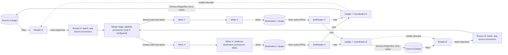
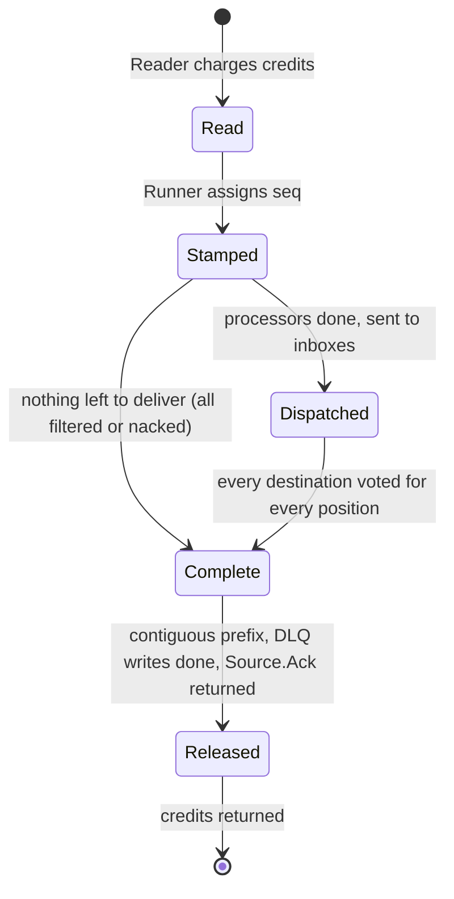

# Staged batch engine: one pipeline engine for Conduit

> **Do not merge before the v0.20.0 tag.** v0.20.0 is in its pre-tag quiet window. Milestone v0.21.0.

## Summary

Conduit ships exactly one pipeline engine. Users never choose between engines. The engine is the **staged batch
engine**: a small set of long-lived goroutines per source and per destination, joined by bounded queues, that moves
batches of records with several batches in flight at once.

It keeps what arch-v2 got right (batches, record flags, the split-run ledger, per-position fan-out acks, run fencing,
per-source DLQ, stop semantics) and replaces what it got wrong: the stop-and-wait loop in `funnel.Worker.Do`, which
allows one batch in flight per source and, behind the shared-tail lock, one per destination. On the early AWS read that
loop costs 25.0% of throughput at 1x1 against v1 (A/A floor 2.3%) and 6.0% at 2x2 (floor 1.8%). v1 overlaps stages but
pays per-record allocation, cannot run one-to-many processors, and is the engine we are trying to leave.

The design pipelines reads, writes and acks, and releases acks to the source strictly as the longest contiguous
completed prefix, so the data-integrity invariants hold by construction rather than by serialising everything.
Memory is bounded by credits, so backpressure is explicit and visible. Persisted position and state formats do not
change. The user-visible `--preview.pipeline-arch-v2` flag becomes a no-op with a deprecation warning once this engine
is the default.

**Tier 1** (data path). **BREAKING CHANGE**, staged over v0.21 to v0.23. Direction approved by DeVaris on 2026-10-09;
this document and its ADR still need Tier 1 review before anything is built on them.

Decision record: [20261009-single-pipeline-engine](../architecture-decision-records/20261009-single-pipeline-engine.md).

## Context and problem

### What exists

- **v1**, `pkg/lifecycle/stream`, the default. A node graph (source, source acker, processors, fan-in, fan-out,
  destination, destination acker) connected by channels. One record per message, each message carrying its own
  context and ack handlers. Stages run on their own goroutines, so reads, writes and acks overlap.
  It cannot run a processor that returns several records for one input (`pipeline.fanout_requires_arch_v2`,
  `pkg/lifecycle/stream/codes.go:31`).
- **arch-v2**, `pkg/lifecycle-poc`, opt-in with `--preview.pipeline-arch-v2`. A `funnel.Worker` per source drives a
  `TaskNode` tree one batch at a time. It supports batches, split runs, destination fan-out and N sources, and is
  required by the `postgres-pgvector-rag` template.

Two engines with a user-visible switch is a DX failure and a standing tax on every data-path change
([20260704-pipeline-architecture-v2](../architecture-decision-records/20260704-pipeline-architecture-v2.md) named the
tax and bounded it; it did not remove it).

### Measured evidence

Early read, **non-gating**: AWS c7i.4xlarge (16 vCPU, Xeon 8488C, Amazon Linux 2023), main at `ce758f96`, harness from
PR #2956 (open; its raw results are to be committed with it). Generator source to file destination, no external I/O,
default config (`sdk.batch.size=0`), records counted at the sink, 20 s warmup discarded, 60 s windows, 5 rounds,
A/A control in the same session. Rates are records per second per sink.

| Shape | v1 (two arms) | arch-v2 | arch-v2 vs v1 | A/A floor (v1) |
| --- | --- | --- | --- | --- |
| 1x1 | 47,688 / 47,924 | 35,930 | **-25.0%** | +/-2.3% |
| 2x2 | 25,947 / 26,075 | 24,454 | **-6.0%** | +/-1.8% |

- arch-v2 against itself is stable (A/A +/-1.0% at both shapes), so the 1x1 gap is not noise.
- PR #2946 (share records read-only across destination-only fan-out branches), arch-v2 2x2: +0.9% against main with
  an A/A floor of +/-1.2%. Inside the floor: it removes allocation, which is not what limits throughput here.
- Per-sink rate in a 2x2 run equals the total source read rate, because every record goes to both destinations.
  Total destination writes per second are therefore about 52k (v1 2x2), 48.9k (arch-v2 2x2), 47.7k (v1 1x1) and
  35.9k (arch-v2 1x1). Three of the four sit near 50k. That is consistent with a common ceiling somewhere in the
  destination or sink path of this harness. It is an observation, not a finding; the profile must say whether it is
  real. It matters for the graduation bar below.

The 6.3x allocation and 3.3x memory figures in the 20260704 ADR came from a mocked 1000-record-batch microbenchmark.
At default config the source returns batches of one, and allocations are not what limits end-to-end throughput at
about 47k records/s. Those figures are not what users get
([20261006-archv2-graduation-gate](../architecture-decision-records/20261006-archv2-graduation-gate.md)).

### Diagnosis: stop-and-wait (hypothesis, to be confirmed by profile)

For one source, one pass of `funnel.Worker.Do` does the following in sequence, on one goroutine, and starts the next
pass only when the last step returns:

1. `Worker.Do` loops one `doTask` pass at a time (`pkg/lifecycle-poc/funnel/worker.go:287`).
2. `SourceTask.Do` blocks in `Source.Read` for the next batch (`funnel/source.go:88`).
3. Processors run on the batch.
4. `processingLock` is taken after the read and held until the batch is end-to-end done (`worker.go:615-620`).
5. With several destinations the pass forks one goroutine per branch and waits for all of them
   (`worker.go:890-894`): the slowest destination sets the pace.
6. `DestinationTask.Do` calls `Destination.Write` (`funnel/destination.go:96`), then blocks reading acks until every
   record in the batch is acked (`destination.go:101-118`).
7. Only then `Worker.Ack` calls `Source.Ack` (`worker.go:922`) and the loop reads again.

One batch is in flight per source. Throughput is the batch size divided by the sum of read, process, write, ack wait
and source ack. With `sdk.batch.size=0` the batch is one record, so every record pays the full round trip alone.

With N sources the shared tail adds a lock: `doTask` takes `taskNode.sharedMu` around the whole shared-tail pass,
including the destination write and its ack wait (`worker.go:445`; the design is described in
`sink.go:52-56`, which only documents it). A destination never has more than one batch in flight across all sources.

v1 does not have this shape. `DestinationNode.Run` writes and hands the message to `DestinationAckerNode`, whose
worker reads acks on another goroutine (`pkg/lifecycle/stream/destination.go`, `destination_acker.go`), and
`SourceAckerNode` releases source acks in order through a semaphore (`source_acker.go`). Its throughput is bounded by
the slowest stage, not the sum.

How the data fits the hypothesis: the gap is largest where nothing else supplies concurrency (1x1) and shrinks at 2x2,
where two workers and two destination branches overlap each other's waits. That fits; it does not prove it.

### What this document does not claim

- That the staged engine will beat v1. The target is not slower than v1 beyond the A/A floor, with lower memory, and a
  clear win where destinations have real latency (which this harness does not exercise).
- Any absolute number. The prototype's profile and runs fill the "Prototype results" section; until then every
  performance statement here is the early read above.

## Goals

1. One engine, no user-selectable mode.
2. Throughput at least v1's at 1x1, 2x2 and 4x4 on the AWS harness within the A/A floor, at lower memory, and a
   large win when destination ack latency is non-trivial.
3. Data-integrity invariants 1 to 7 hold, each argued below and each with a named test.
4. One-to-many processors (`sdk.MultiRecord`: `ai.chunk`, `split`, `clone`) work natively, including across
   destination fan-out.
5. Memory is bounded by construction; stalls are visible and attributable.
6. No new tuning knobs unless justified here. The defaults are derived, not configured.
7. Persisted position and state formats are byte-compatible in both directions.

## Non-goals

- Engine choice. The only engine selector that survives is a hidden, time-limited fallback to v1 (v0.22 only).
- Clustering, membership, leader election, rebalancing in the engine
  ([20260704-single-node-engine](../architecture-decision-records/20260704-single-node-engine.md)).
- Flink-class stateful processing. This design leaves one seam (below) for the local state layer
  ([20260704-local-state-only](../architecture-decision-records/20260704-local-state-only.md)) and builds nothing for it.
- A columnar record representation. It stays inside `Batch`
  ([20260823-columnar-record-representation-scoped-to-archv2](../architecture-decision-records/20260823-columnar-record-representation-scoped-to-archv2.md));
  nothing here forecloses it.
- Any change to `conduit-connector-protocol`. The engine cannot ask a source for N records (the stream is
  `SourceRunRequest{AckPositions}` / `SourceRunResponse{Records}`); batching on the read side is `sdk.batch.*` in the
  source plugin plus engine-side aggregation.
- Exactly-once. At-least-once is the floor and the ceiling.
- Ordering across sources, or parallelism inside one source's stream.
- Parallel stateless processors. A later change, gated on a public processor-spec contract.
- Destination isolation (a slow lane for a slow destination). The slowest destination sets the pipeline's pace.

## Constraints

- **Protocol is fixed.** Source: `Recv` records, `Send` ack positions. Destination: `Send` records, `Recv` acks
  matched to writes by order only; there are no correlation IDs. Concurrent `Send` and `Recv` on one stream is safe;
  concurrent `Send` and `Send` is not.
- **`connector.Source.Ack` already defers the plugin ack until the position is durable.** It records
  `State.Position = p[len(p)-1]`, queues the persist, and only the persister's confirmation releases the plugin ack
  (`pkg/connector/source.go:564-625`, invariant 1). `Source.Teardown` flushes the persister and delivers the final ack
  before closing the stream (`source.go:376`). The engine builds on this; it does not reimplement it.
- **Built-in connectors use an unbuffered in-memory stream that clones requests on `Send`**
  (`pkg/plugin/connector/builtin/stream.go`), so plugin code never shares the engine's records. Pipelining depth to a
  built-in destination is therefore small (one write in the plugin, one being handed over), and the win there is
  overlapping engine work with the plugin's write. That clone is also why PR #2946 can share records read-only across
  destination-only fan-out branches. The AckReader must always be receiving, because the plugin's ack `Send` blocks
  until it is.
- **Positions are unique only within a source.** They can never be keys across sources (the H2 bug class).
- **Processor instances are single-caller.** WASM instances and many built-ins are not safe for concurrent `Process`.
  The engine must never call one instance from two goroutines at once.
- **Public contracts** (CLAUDE.md): pipeline config schema, error codes, connector protocol, CLI flags, metrics names.
  Changes need a versioning plan and the deprecation policy (announce, warn, remove after at least two minors).
- **Process.** Solo maintainer; Tier 1 needs a human sign-off from a separate session; the v0.20.0 quiet window forbids
  merging this before the tag. Nearby lanes: LC (`service.go` status writes), TC (`connector/source.go`,
  `persister.go`), EV (`lifecycle-poc` reading connector `Errors()`, #2929), AV2 (funnel fan-out #2910, harness #2909).
  Expected conflicts are in the implementation PRs, not in this one.

## Architecture

### Shape



Life of a batch in the ledger:



### Components

**Reader** (one goroutine per source). The only caller of `Source.Read`. Waits until its source has free credits, calls
`Read`, charges the actual size, and queues the response for the runner. It never allocates a batch itself. `io.EOF`
means the source is exhausted and arms a graceful stop for that source only, as today (`worker.go:543-590`).

**Runner** (one goroutine per source). Takes the first queued read response plus whatever else is already queued, up to
a record cap and a byte cap, stamps a per-source sequence number, and registers the batch in the source's ledger.
It then runs the source's own processors to completion, including every `Retry` re-run and every split, and only then
emits the batch. A batch leaves the runner with every split run whole. Records filtered or nacked by processors are
recorded in the ledger as terminal (filtered) or nacked; a batch with nothing left to deliver is marked complete
without touching a destination.

**Merge stage** (one goroutine per pipeline, present only if the pipeline has pipeline-level processors). Takes batches
from all runners in arrival order and runs pipeline-level processors. This is where cross-source serialisation is
legitimate: those processors are single instances, may be stateful (a dedup across sources is a valid use), and see one
caller, exactly as after v1's fan-in. Without pipeline-level processors the runners dispatch directly.

**Dispatch.** The batch is shared read-only with every destination inbox (reference count = number of destinations plus
the ledger). A destination branch that contains only the destination task shares the records; a branch with any other
task (in practice a destination processor) gets a copy, matching the allow-list in PR #2946 (`branchMutatesRecords`).
The runner or merge stage pushes in sequence order, so each inbox sees each source's batches in order.

**Inbox** (one per destination). A bounded FIFO of batch references, merging all sources by arrival. Per-source order is
preserved; cross-source order is not specified.

**Writer** (one goroutine per destination). The only caller of `Destination.Write`. Takes a FIFO prefix of the inbox up
to the destination's preferred write size (coalescing small batches, never reordering, never waiting for more),
applies the destination's own processors, appends a record of expected acks to the in-flight FIFO **before** calling
`Write`, and calls `Write`. It does not wait for acks. It blocks only when the unacked window is full or the transport
applies backpressure.

**AckReader** (one goroutine per destination). The only caller of `Destination.Ack`. Matches each incoming ack to the
head of the in-flight FIFO by order, checks the position bytes as a sanity check, and turns record-level results
into per-position votes for the owning source's ledger. It never blocks on a coordinator, a DLQ or a source.
It is the single consumer of its ack stream by construction, which removes the cross-worker ack-desync class that
`TaskNode.poisoned` exists to contain (`worker.go:445-500`, H2).

**Ledger and coordinator** (a mutex-guarded ledger plus one goroutine, per source). The ledger holds, per sequence
number, the positions, the per-position vote tally and any nack. It generalises `multiAckNacker` (per-position
unanimity, nack wins, released in source order,
[20260731-archv2-fanout-ack-model](../architecture-decision-records/20260731-archv2-fanout-ack-model.md)) from one
batch to a window of batches. The AckReader records votes under the ledger mutex and signals the coordinator on a
one-slot channel. The coordinator wakes, takes the longest contiguous prefix of complete batches, and, outside the
mutex, for each nacked position writes to the source's DLQ, then calls `Source.Ack` once with the prefix's positions,
then returns the prefix's credits. The mutex is never held across I/O or a channel send.

**Credits.** Per source, in records and estimated bytes. The reader waits for free credits before reading, then
charges what it got, so memory overshoots the cap by at most one read response. The runner charges any growth when a
processor amplifies a batch (see one-to-many). A single batch larger than the whole window is admitted when nothing
else is in flight, otherwise it could never run. Credits return when the coordinator's `Source.Ack` for the prefix
returns, not when the persister flushes: `Source.Ack` already withholds the plugin ack until durable, so credits
bound engine memory, and the persister bounds upstream retention.

Starting values: window of 4,000 records or 64 MiB per source, whichever is hit first; batch caps of 1,000 records and
4 MiB. Sizing rule: the sustainable rate is window divided by end-to-end ack latency. 4,000 records at 100 ms is 40k
records/s; the stop-and-wait engine at batch size 1 is capped at 10 records/s for the same destination. These are
starting values for the prototype to tune, not final (open question 4).

**Adaptive batching.** No user setting.

- The reader passes through whatever the plugin returns. The engine cannot ask for N.
- The runner builds a batch from everything already queued. Under load, batches grow by themselves, because the runner
  is busy while responses accumulate.
- When responses are arriving faster than the linger window (inter-arrival gap below 2 ms), the runner waits up to
  2 ms for more, up to the caps. When they are not, it dispatches at once. So an idle or trickling source pays no added
  latency, and a hot source pays at most 2 ms.
- The writer coalesces whatever is in its inbox, up to the destination's preferred write size, and never waits.
  The preferred size is the destination's `sdk.batch.size` if set, else the batch cap.

This differs from the approved brief, which put a fixed linger in the reader. A fixed linger in the reader adds latency
to a trickling source for no gain, and the reader cannot enforce it anyway because it is blocked in `Read`.
The linger lives in the runner and engages only when it can pay for itself. The 2 ms is a constant, not a setting.

**Fan-out sharing.** One shared read-only batch per fan-out, reference counted. The batch's slices are released when
the last destination branch and the ledger are done with it. No record slice is pooled or reused until its prefix is
released: the ledger needs the records for DLQ writes, and sibling branches read the same slices.

**N sources by M destinations.** Each source has its own reader, runner, ledger and coordinator; each destination has its
own inbox, writer and AckReader. There are no per-pair goroutines and no shared lock. The coupling between sources is
only the destination's inbox order and unacked window, which is the destination's real capacity. The coupling between
destinations is that a source's batch completes only when all of them have voted, so the slowest destination sets that
source's pace, and the credit window turns a stalled destination into a visible pause rather than unbounded buffering.

### Lifecycle

**Start.** Open the shared sink (destinations, pipeline processors) before any worker, as today. Start the stages.

**Graceful stop** (user `Stop`, `StopAll`, SIGTERM; recorded as a stop request before anything is told to stop, per
[20261007-stop-requested-never-recovers](../architecture-decision-records/20261007-stop-requested-never-recovers.md)).

1. The reader stops asking for new reads. A reader blocked in `Read` is released the way v1 does it: `Source.Stop`
   returns the last position the plugin will emit, and the reader reads until it has seen that position
   (`pkg/lifecycle/stream/source.go:221-244`). The funnel `Source` interface has no `Stop` today and tears the source
   down instead (`funnel/source.go:36-47`, `Worker.Stop`); that cannot be used with batches in flight, because
   `Source.Ack` fails once the stream is torn down. This must be validated in the prototype for built-in and
   standalone sources (open question 12).
2. The runner flushes what it holds. Writers drain their inboxes. AckReaders keep reading.
3. Wait until the ledger's released prefix equals everything dispatched, bounded by the stop deadline
   (`DefaultStopAndWaitTimeout`, 30 s for `StopAndWait`, the runtime's exit timeout for shutdown).
4. `Source.Teardown` (flushes the persister and delivers the final plugin ack before closing the stream), then close
   the sink after every worker has exited, as `Sink.Close` requires today.
5. If the deadline passes, take the force path. A forced or timed-out stop is `UserStopped`/`SystemStopped` with the
   error recorded and is never recovered.

**Force stop and stage errors.** Cancel the pipeline context. Every blocking wait selects on it. Cancellation and
transport errors cast no votes. Nothing past the already-released prefix is acked. The unreleased tail replays.

### Concurrency model and goroutine budget

Per pipeline: 3 goroutines per source (reader, runner, coordinator), 2 per destination (writer, AckReader), 1 merge
stage if pipeline processors exist, plus the supervisor that exists today. Total **3N + 2M + 1 (+1)**: linear in sources
plus destinations. arch-v2 today runs N workers and, per pass, up to M branch goroutines per worker
(`worker.go:890`), so up to N x M transient goroutines. v1 runs a goroutine per node and extra helper goroutines per
publisher/subscriber node (`pkg/lifecycle/stream/base.go:153,174`).

Synchronisation, by rule:

- One ledger mutex per source, held only for in-memory updates. It is the only lock on the data path.
- Everything else is a bounded queue or a one-slot signal. No lock is held across `Read`, `Write`, `Ack`, `Source.Ack`,
  a DLQ write, a processor call or a channel send.
- Each plugin stream direction has exactly one goroutine: `Read` (reader), `Write` (writer), `Ack` (AckReader).
  Each processor instance is called from exactly one goroutine.

Deadlock freedom. The data flow is a cycle (credits flow back to the reader) but the waits are not. The wait-for chain
is: reader waits on credits; credits wait on the coordinator; the coordinator waits on votes and on I/O to the source
and DLQ; votes wait on AckReaders; AckReaders wait only on their destination plugin; writers wait on the unacked window
(freed by AckReaders) and on the plugin; runners wait on inbox space (freed by writers). Nothing in that chain waits on
a later stage in the same chain except through a bounded resource that the earlier stage's progress does not depend on.
The one hazard is a batch waiting for credits it needs itself: handled by admitting an over-window batch when nothing
else is in flight, and by charging amplification against the batch's own source only when older batches exist to free
credits.

## Invariants

Each is stated, then argued for this design. Enforcement sites carry `// Invariant N:` comments in the
implementation, and each has a test that fails if the line is removed.

**1. Never acknowledge a record upstream before it is durably handled downstream.**
`Source.Ack` is called from exactly one place, the coordinator's prefix release. A position enters a released prefix
only if, for every record it covers, the ledger holds a terminal disposition: acked by all M destinations, filtered by
a processor, or written to the DLQ with the write confirmed. A destination vote is created only by the AckReader from an
explicit positive ack matched to a write. Cancellation, timeouts, transport errors and protocol violations create no
votes. Pipelining adds no new way to ack early, because the vote for a write still arrives only when the destination
acks it. Coalescing and the per-position tally keep a destination from voting for a position it did not write.
`Source.Ack` then defers the plugin ack until durable (existing). Credits are not acks.
Test: early-ack mutation in the coordinator fails `TestStaged_NoAckBeforeAllVotes` and the SIGKILL gap check.

**2. Positions and offsets are monotonic and crash-safe.**
The coordinator is the only writer of source position and releases prefixes in ascending sequence order, one goroutine
per source. Prefixes are contiguous, so the sequence of positions handed to `Source.Ack` is the source's own order with
no gaps and no regressions. After a failed `Source.Ack` or DLQ write the coordinator releases nothing further (v1's
`SourceAckerNode.fail`). Empty and duplicate positions are rejected at dispatch with the existing coded errors
(`pipeline.empty_source_position`, `pipeline.duplicate_source_position`); positions are outputs, never keys.
The persisted format is untouched: `SourceState{Position}` written by the existing persister. Crash safety is the
persister's existing atomic batch commit.
Test: property test on release order; position-format golden test; upgrade tests.

**3. At-least-once is the floor.**
Every record read is in exactly one of: unreleased (will replay), or released with a terminal disposition. No bounded
queue drops; they block. Error, shutdown and cancel paths release at most the contiguous completed prefix and replay the
rest. A DLQ failure releases the prefix up to the last record whose DLQ write was confirmed and then fails the
pipeline, as `Worker.Nack` does today (`worker.go:959-1020`). There are no rebalances in a single-node engine.
Test: chaos SIGKILL with k in flight; forced stop; DLQ-failure test.

**4. Ordering guarantees are per source and documented.** See the next section for the contract and its mechanism.
This is the invariant most affected by the change, and per CLAUDE.md the change needs explicit sign-off.

**5. State and checkpoint writes are atomic.**
This engine adds no durable state. Positions go through the existing persister transaction. For the future state layer
the seam is the coordinator's prefix release: a keyed processor stage would expose a checkpoint for exactly the prefix,
written in the same persister batch as the position. Nothing is built for that now. Every future state feature still
ships the kill-mid-write recovery test; the existing store-fault harness (`tests/chaos/store_fault.go`) is reused.

**6. Schema handling never silently mangles data.**
The engine moves records by reference and neither reads nor rewrites payloads. Coalescing concatenates slices.
The size estimator reads, never mutates. The only mutation points are processors, as today. A schema or type problem is
a record-level nack to the DLQ or a pipeline error, never a drop. (A future columnar `Batch` must keep this property;
that is its ADR's problem.)

**7. Shutdown is graceful by default; `kill -9` is recoverable.**
Graceful stop is the bounded drain above, ending in `Source.Teardown`'s flush. A SIGKILL at any instant leaves only
disposable in-memory state; resume is from the persisted prefix and replays at most the credit window. The chaos suite
kills at each of the points in the failure-mode table.

## Ordering semantics (contract)

1. **Per source, per destination, total order.** The records a destination first receives from one source arrive in the
   order that source produced them. This holds across batches, across coalesced writes, and through filters, splits and
   DLQ removals (a removed record leaves a gap, never a swap). It is stronger than per-partition order and implies it.
2. **Nothing across sources.** No ordering between records from different sources at any destination. FIFO by arrival at
   the inbox is an implementation behaviour, not a promise.
3. **Splits are contiguous.** The pieces of one input record reach a destination adjacent and in order, at the position
   of the input record.
4. **Redelivery is not reordering, but it is repetition.** After a crash the replay starts from the persisted prefix and
   preserves rule 1 for itself. A destination can see earlier records again after later ones from before the crash.
5. **DLQ.** Each source's DLQ receives its nacked records in source order.

Mechanism: one reader and one runner per source, sequence numbers, a single goroutine dispatching each source's
batches in order to every inbox, FIFO inboxes, one writer per destination taking only FIFO prefixes, an ordered
stream, FIFO ack matching, and ledger release in sequence order. A future parallel stateless-processor pool must
reassemble in order; without that guarantee it does not ship.

## One-to-many processors and split runs

The RAG template (`postgres-pgvector-rag`: source, `ai.chunk`, `ai.embed`, pgvector) depends on a processor returning
several records for one input, so the single engine must run them natively.

- `Batch.SplitRecord`, the record flags and the split-run ledger (`run_ledger.go`) are reused unchanged. A split run's
  original position is released to the ledger only when every piece is terminal
  ([20260801-archv2-split-run-ack-ledger](20260801-archv2-split-run-ack-ledger.md)).
- **A stage completes its batch before it emits.** The runner (and the merge stage) finish every `Retry` re-run and every
  split before handing the batch on, within the existing bounds (`maxRetryAttempts`, `maxRetryStall`,
  `pipeline.retry_not_converging`). A batch therefore never leaves a stage holding part of a run. Destination fan-out
  never sees a straddling run. This removes the failure `pipeline.split_run_straddles_fanout` still reports on main
  today ("Known limit" in the flag's usage text) without the defer-the-fan-out buffer of
  [20260801-archv2-run-join-defer-fanout](20260801-archv2-run-join-defer-fanout.md), which is not implemented on main.
  The cost is the one that design already accepted: an early piece waits for its slower siblings before it reaches a
  destination, while the source-visible ack latency is unchanged, because the run's position could not be released
  earlier anyway.
- **Destination processors that split** do so inside the writer. The expected-ack FIFO entry carries the mapping from
  written pieces to original positions, and a per-destination run ledger turns piece acks into one vote per original
  position (nack wins within a run). This is `runAckNacker` moved from the call chain into the AckReader path.
- **Amplification and credits.** Credits are charged on records as read. After a processor stage, the runner charges the
  growth (output size minus input size) to the same source's credits and may block for them. One chunking step turning
  one document into thousands of pieces therefore shows up as backpressure on the reader, not as unbounded memory in
  an inbox. If the batch is the oldest in flight there is nothing to wait for, so it proceeds.
- **DLQ.** A nacked piece nacks the original record. The DLQ receives the original, pre-split record, as today.
- The `rag-e2e` required check (which already runs the template on the flag) is the end-to-end gate for this section.

## Failure modes

Tests are planned names unless stated. None of them exist yet; the Tier 1 rule applies to the implementation PRs.

| Failure | Detection | Behaviour | Invariants | Test |
| --- | --- | --- | --- | --- |
| Crash (SIGKILL) with k batches in flight | Process death; the next boot restarts the pipeline from the persisted position | All in-memory state is lost. Position is the last released prefix. Read-but-unreleased batches replay, whether or not a destination already wrote them: duplicates up to the credit window, never a gap | 1, 2, 3, 7 | `tests/chaos` `TestStagedSIGKILL_KInFlight`, k in {1, 2, 4, 16, window}; kill points: after Write before ack, after destination ack before release, between DLQ write and `Source.Ack`, mid-persist. Assert gapless, monotonic, duplicates at most the window |
| Destination stall (stream open, no acks) | Unacked window full; ack lag and oldest-unacked age rise; stall reason `writer: unacked window full (destination X)` | Writer blocks, inbox fills, dispatch blocks, runner blocks, credits exhaust, every reader of the pipeline pauses. Nothing dropped; memory flat. No automatic timeout (open question 9) | 3 | Stalled-destination fake: reads stop within the window; resident bytes plateau; resume on first ack |
| One of M destinations slower | Per-destination queue depth and unacked metrics diverge; stall reason names the slow one | Pipeline rate follows the slowest destination; the fast one idles. Same as v1's fan-out and the funnel's `p.Wait()` | 1, 3 | NxM benchmark shape with an injected-latency destination; assert no unbounded growth |
| Nack mid-prefix (record i of batch k nacked while batch k-1 is incomplete and k+1 is complete) | Error ack from a destination or processor nack | Ledger marks the position nacked (nack wins across destinations). Later complete batches wait. When the prefix reaches it, the coordinator writes the DLQ, then includes the position in the released prefix. DLQ window and threshold are evaluated in source order | 1, 3, 4 | Property: random nack sets and completion orders; DLQ gets exactly the nacked set once; released positions gapless; nothing released past an unresolved earlier position |
| DLQ failure (write error or nack threshold exceeded) | DLQ write error or `DLQ.Nack` fatal | Fatal, not recoverable (a retry loop would rewrite the DLQ forever, as `Worker.Nack` documents). Release the prefix up to the last confirmed DLQ write, nothing past it; pipeline `Degraded` | 1, 3 | DLQ fake failing at record j: acked prefix ends at j-1; restart resumes at j |
| Persister failure | Connector `Errors()` channel; `Source.Ack` error; log `failed to persist connector batch` | Pipeline error, `Degraded`, matching v1 (`docs/operations/connector-state-write-failures.md`; arch-v2 today stays `Running`, which this changes). The plugin ack is withheld by `connector.Source`, so no upstream data is released. Reading continues for at most the detection time | 1, 3 | `tests/chaos` store-fault harness against the engine; depends on EV lane #2929 |
| Stop during drain | Stop request recorded; drain deadline | Reader stops by the `Source.Stop` protocol; runner flushes; wait for prefix equals dispatched; at the deadline, force path. Status per ADR 20261007: stopped, error recorded, never recovered | 1, 7 | Stop with k in flight; stop with a stalled destination (deadline path); stop racing a transient error (no restart) |
| Force stop | `Stop(force)`, `StopAll(force)`, or drain deadline | Cancel the context. Cancelled calls cast no votes. No `Source.Ack` after cancel except an optional best-effort release of an already-complete prefix, never required for correctness. `Source.Teardown` flushes; the tail replays | 1, 3, 7 | Extend the existing force-stop tests; chaos force-stop with k in flight |
| Plugin crash (source or destination) | `Read`/`Recv`/`Send` error, stream closed, process exit | Stage error cancels the pipeline context; all stages exit; unreleased batches replay; transient classification and backoff recovery per 20240812. A closed-stream `io.EOF` never masks the real cause (#1659) | 1, 3 | Kill the destination plugin with k in flight; kill the source plugin; assert recovery and no gap |
| Ack protocol violation (wrong position, surplus ack, ack with nothing outstanding, EOF with writes outstanding, duplicate ack) | AckReader FIFO check | New fatal code `pipeline.ack_protocol_violation` naming the destination and the expected and received positions. The AckReader casts no vote for the violating ack and stops; votes already cast stand. Fatal because a destination that acks the wrong record cannot be trusted and a restart reproduces it | 1 | Fake destination injecting each violation; no source ack for an affected position; `FuzzAckReader` over the ack stream parser |
| Memory pressure | In-flight bytes versus cap; Go heap and `GOMEMLIMIT`; oversize record; amplification | Credits bound resident source batches; oversize record admitted only when alone; amplification charged to credits; no load shedding. If the OS kills the process, it is the SIGKILL row | 3, 7 | Large-record and amplification soak: resident bytes within cap plus one response; 24 h leak check |
| Internal accounting bug (double vote, vote for a released sequence, gap, over-count) | Assertions in the ledger (as `splitRun.complete` does today) | Fatal coded error, nothing released past the inconsistency. Asserted, not assumed | 1, 2 | Property tests drive illegal vote sequences and expect the fatal path |

## Backpressure and memory bounds

The chain is: destination slow, unacked window full, writer blocks, inbox fills, dispatch blocks, runner blocks, credits
exhaust, reader stops calling `Recv`. Past that point the source plugin's own buffering applies (gRPC flow control, the
SDK's read loop); that memory is the plugin's, not the engine's.

Resident engine memory per pipeline, worst case:

```text
sum over sources of (credit_bytes + one read response)
  + sum over destination branches with processors of (unacked_bytes)     // copies
  + amplification, charged to credits
```

Shared batches are not copied per destination, so M does not multiply the first term. The oversize-record rule and the
amplification rule are the two places where the bound is soft, and both are stated above. A process-wide cap across
many pipelines is not designed here; with the defaults, `N x 64 MiB` per pipeline is the planning number
(open question 4).

Byte estimation must be cheap. `StructuredData.Bytes()` is `json.Marshal`, which is the cost `--preview.pipeline-arch-v2-disable-metrics`
exists to avoid. The estimator therefore sums raw lengths, position and metadata sizes, and a bounded shallow estimate
of structured payloads, and never marshals. The record-count cap is the hard bound; the byte cap is a guard rail for
large payloads (open question 7).

## Observability

Requirements: a human or an agent can tell, from `pipelines inspect` and metrics alone, which component is stalled, on
what, and for how long.

**Inspect and `--json`.** Add a `flow` object to the inspect result, and an `engine` field (`staged` or `classic`) so a
fallback is visible. Illustrative shape:

```json
{
  "engine": "staged",
  "flow": {
    "sources": [{
      "id": "pg-src", "in_flight_records": 3120, "in_flight_bytes": 4812211, "credits_available_records": 880,
      "ack_lag_ms": 41, "released_prefix_age_ms": 12,
      "stall": {"component": "reader", "reason": "waiting_for_credits", "blocked_on": "destination:pgvector-dst",
                "since": "2026-10-09T12:00:03Z"}
    }],
    "destinations": [{
      "id": "pgvector-dst", "inbox_records": 1500, "unacked_records": 2048, "oldest_unacked_age_ms": 9300,
      "stall": {"component": "writer", "reason": "unacked_window_full", "since": "2026-10-09T12:00:01Z"}
    }]
  }
}
```

`blocked_on` is derived by following the wait chain: a reader waiting for credits looks at its ledger's oldest
incomplete sequence and names the destinations that have not voted for it. Each blocking wait site records
`(component, reason, since)` in an atomic; there is no per-record cost.

Reasons: `waiting_for_credits`, `inbox_full`, `unacked_window_full`, `waiting_for_destination_ack`,
`dlq_write`, `source_ack`, `persister`, `processor`. The inspect carrier needs an additive API field (open question 8).

**Metrics.** Existing names and labels are unchanged. Additions, under the existing `conduit_` prefix and
`pipeline`/`component_id` labels:

- `conduit_pipeline_inflight_records`, `conduit_pipeline_inflight_bytes` (gauge, per source)
- `conduit_pipeline_credits_available_records` (gauge, per source)
- `conduit_destination_inbox_records`, `conduit_destination_unacked_records` (gauge, per destination)
- `conduit_pipeline_ack_lag_seconds` (histogram, per source: read to `Source.Ack`)
- `conduit_stage_batch_records` (histogram, per stage)
- `conduit_pipeline_stall_seconds_total` (counter by `component`, `reason`)

Existing connector throughput metrics are normalised to v1's meaning, once per record at completion. arch-v2 observes
twice (on read and on ack), which #2748 showed makes it incomparable.

**Runbooks** (written with the implementation, under `docs/operations/`, symptom, diagnosis, remediation):
`pipeline-stalled.md` (one section per stall reason), `engine-fallback.md` (the hidden v1 fallback, v0.22 only, with its
limits), and updates to `connector-state-write-failures.md` for the changed `Degraded` behaviour.

**Logs.** Stage start and stop at debug, stall transitions at info with the stall reason, every fatal with its code.

## Security

- The plugin boundary is unchanged: gRPC and in-memory streams to connectors, WASM for standalone processors.
  The WASM host egress policy (SSRF guard, host-injected secrets) is not touched; the engine does not call out.
- The attack surface shrinks. One engine instead of two; no `sharedMu`/`poisoned` machinery; each ack stream has one
  reader by construction; no per-pass goroutine fan-out; v1's node graph is deleted.
- New surface, and what covers it: the ack-stream parser (fuzzed, and every violation fails closed), credit accounting
  (the engine measures record sizes itself and never trusts a plugin-reported size), and the new `flow` inspect output.
  The inspect output carries connector IDs, counts and ages, never record payloads; positions in error messages are
  truncated.
- Memory exhaustion by a hostile or buggy source is bounded by credits at the engine; a connector that floods the
  stream is held back by flow control because the reader stops calling `Recv`.
- The hidden fallback flag selects an existing, already-shipped engine. It adds no capability.

## Alternatives

### A. Keep arch-v2 stop-and-wait and tune batch size

Fixed per-pass cost is real (`BenchmarkEnginePass`: 1,847 ns and 14 allocs per record at batch 1, 654 ns and 5 allocs at
batch 1000), and larger batches amortise it. They do nothing about the serial round trip: throughput stays batch size
over the sum of stages, so a 100 ms destination commit still limits each source to one batch per 100 ms plus everything
else. Bigger batches also cost latency, memory and a larger duplicate window on every crash, and at default config the
batch is one because the SDK batch size defaults to 0, so the fix would be a user tuning setting. It also leaves
the shared-tail lock, so N sources never overlap on a destination.
Lost because it moves the knee of the curve without changing its shape, and it makes users the tuners.
Not run: arch-v2 2x2-batched on the AWS harness. The prototype's runs should include it, to show how much of the 1x1 gap
batching alone recovers.

### B. Batch messages inside v1's node graph

The smallest diff on the engine with the best pipelining. But `Message` carries per-record context, handlers and
metadata (about 69 allocations a record in the committed benchmark), and every node (source, acker, processors, fan-in,
fan-out, destination, acker, DLQ) assumes one record per message and one ack per message. Making them batch-aware is a
rewrite of the same size as the new engine, inside a structure with a goroutine and channel hop per node. v1 also has no
split-run support, so the RAG template would need the ledger built into v1 anyway, and the unbounded `DestinationAckerNode`
queue would still need a bound.
Lost on cost and shape. It remains the **fallback plan**: if the prototype cannot bring 1x1 to v1 parity because the
bottleneck is below the engine (the plugin SDK or gRPC), this is the next thing to evaluate.

### C. Keep two engines with a user choice

No design effort. But every Tier 1 change has to be reasoned about, tested and fixed twice (the dual-maintenance tax
in the 20260704 ADR, and visible in the recent history: H1, H2, #2722, #2723, #2728 and #2729 are all engine-specific).
Behaviour already differs by engine in ways users hit: persister failures degrade the pipeline on one and leave it
running on the other, and one-to-many processors work on only one. Users cannot choose well: we spent weeks unable to
produce a valid cross-engine number (#2748). Docs, support and the test matrix double.
Lost on DX and on cost, which is why the decision exists.

### D. Kafka Connect task model: one thread per connector

KC runs a thread per task. A source task polls, hands records to a producer asynchronously and commits offsets on a
timer after flushing the producer (`offset.flush.interval.ms`, 60 s by default); a sink task `put`s batches and
`flush`es before committing. That shape has real merits (simple, few threads), but it does not fit here. Offset commit is
a periodic stop-the-world barrier that assumes one Kafka sink, so duplicates after a failure can span the whole commit
interval; Conduit acks per record to arbitrary destinations with N x M fan-out. A synchronous `put` per task is
stop-and-wait again. Its operational weight (worker clusters, rebalancing) is exactly what
[20260704-single-node-engine](../architecture-decision-records/20260704-single-node-engine.md) rejects.
We keep the useful part, a small fixed set of goroutines per connector with bounded handoff, and keep Conduit's
per-position ack protocol.

### Design choices inside the chosen architecture

- **Ledger as mutex plus coordinator goroutine**, not inline in the AckReader and not a channel of events. Inline would
  let a slow DLQ or `Source.Ack` stall a destination's ack reading and couple unrelated sources. A channel needs a
  capacity that is either unbounded or deadlock-prone. A mutex-guarded ledger with a one-slot signal never blocks the
  AckReader and has a capacity bounded by credits.
- **Credits in records and bytes, not batches** (the brief's "about 4 batches"). Sources that return one record per read
  would otherwise get a window of four records.
- **Per-position tally, not per-batch counter.** Already decided and re-affirmed: a per-batch counter cannot represent
  divergence between destinations.
- **Pipeline-level processors in a merge stage, not per source path.** The brief proposed running them per source path with
  no shared lock. A pipeline-level processor is one instance, possibly stateful across sources and not safe for
  concurrent calls. Running it from N goroutines needs either a lock (the thing being removed) or N instances (changing
  semantics for stateful ones). A merge stage keeps the single-caller rule at the cost of one goroutine, and only when
  such processors exist. It is the same serialisation v1 has after fan-in.
- **Always share, copy iff the branch can mutate**, per the #2946 allow-list. The brief's "copy on write" cannot be done
  because processors mutate in place and the engine cannot see it. A later `mutates` declaration in the processor spec
  could refine the copy (see open question 3).

## Breaking changes and migration

This is a **BREAKING CHANGE** for users of the flag, for users whose pipelines depend on engine-specific behaviour, and
(through the processor batch contract) for some processors. It is staged.

### The flag

`--preview.pipeline-arch-v2` (config key `preview.pipeline-arch-v2`, environment variable
`CONDUIT_PREVIEW_PIPELINE_ARCH_V2`) and `--preview.pipeline-arch-v2-disable-metrics`.

| Release | `--preview.pipeline-arch-v2` | Notes |
| --- | --- | --- |
| v0.20.0 | Unchanged. Opt-in funnel engine. | Release notes say the flag is temporary and a single engine is coming. It is not hidden: the RAG template needs it for one-to-many processors (`pipeline.fanout_requires_arch_v2`). **Announce.** |
| v0.21 | Unchanged meaning from the user's side. | The staged engine is built and exercised by tests and nightly differential runs. Whether it replaces the funnel behind the existing flag in v0.21 depends on the graduation evidence; if it does, it is announced in the release notes, because it changes behaviour (below). No second user-facing switch. |
| v0.22 | Accepted and ignored; logs a deprecation warning on every start. The staged engine is the default. | **Warn.** A hidden fallback `--preview.classic-engine` (name provisional) selects v1. It is documented only in the runbook, with a tracking issue, and cannot run one-to-many pipelines (v1 stops them with `pipeline.fanout_requires_arch_v2`). |
| v0.23 | Still accepted and ignored, still warns. v1 and the fallback flag are deleted. | The fallback is deleted only after one release with no reported use. |
| v0.24 or later | Removed. | At least two minors after the first warning, per CLAUDE.md. The flag therefore outlives v1 by one release. |

`--preview.pipeline-arch-v2-disable-metrics` follows the same schedule if the staged engine's byte accounting costs
under 1% in the benchi shapes; otherwise it needs a successor, which is a new knob and needs its own decision
(open question 10).

### User-visible behaviour changes

| Area | Change | Who notices |
| --- | --- | --- |
| Throughput and latency | Expected at least v1's throughput. Added latency at most 2 ms on a hot source, none on a trickling one. | Everyone; lower or equal latency is expected, not guaranteed. |
| Memory | Bounded by credits. v1 has an unbounded queue in `DestinationAckerNode`. | v1 users with slow destinations see flat instead of growing memory. |
| Duplicate window after a crash | Up to the credit window (4,000 records or 64 MiB at the starting values) per source. Comparable to v1, larger than the funnel's single batch. Still at-least-once. | Non-idempotent destinations after a crash. |
| Position persistence cadence | Positions advance per released prefix and are written by the unchanged persister (1 s or 10,000 changes). | Nobody; upstream retention release cadence is unchanged. |
| Status and recovery | Stop semantics per ADR 20261007, unchanged. Persister failure degrades the pipeline (v1 behaviour); today under the flag it stays `Running`. Stage error recovers the whole pipeline with backoff, unchanged. | Flag users who relied on `Running` during persister failures. Depends on EV #2929. |
| DLQ timing | A nacked record is written to the DLQ when the released prefix reaches it, in source order, not at nack time. | Operators watching the DLQ in real time under a slow earlier batch. |
| Ordering | Per-source, per-destination order preserved; now stated as a contract. Cross-source order was never promised. | Documentation only. |
| Processor batch sizes | Processors receive 1 to cap records per call. v1 always passed one. A processor that assumes one record per call (custom WASM, third-party) may misbehave. | Users with custom processors. Mitigation: a conformance run of built-in and registry processors at batch sizes above 1 before v0.22; release-note callout. |
| `sdk.batch.size` and `sdk.batch.delay` | Unchanged defaults and meaning. Source-side batching still comes from the plugin. Destination-side `sdk.batch.delay` now interacts with pipelined writes: a destination with a batch size larger than the unacked window cannot fill and degrades to delay-bound. Pipeline start warns when a destination's `sdk.batch.size` exceeds the window, and the window scales to at least twice that size (derived, not configured). | Users who set destination batching. |
| Metrics | Names and labels unchanged; new metrics are additive. arch-v2's double observation is normalised to v1's once-per-record meaning, so values change for flag users. | Dashboards of flag users. |
| Error codes | Added: `pipeline.ack_protocol_violation`. Retired, never emitted but kept registered for the deprecation window: `pipeline.shared_destination_poisoned`, `pipeline.split_run_straddles_fanout`. `pipeline.fanout_requires_arch_v2` is emitted only by the v0.22 fallback. `lifecycle_v2.*` codes stay. `llms.txt` and `llms-full.txt` are updated in the same PR. | Anything matching on these codes. |
| Inspect and API | Additive `engine` and `flow` fields. | Agents and the UI; additive. |

### Connector expectations

- **Pipelined writes.** The engine sends further `Write`s while earlier acks are outstanding. The protocol permits it,
  v1 already does it (its destination node never waits for acks), and the Go SDK's destination `Run` loop is a
  sequential `Recv` and write loop that acks in order. It is not yet verified for connectors written against other SDKs
  or hand-rolled protocol implementations. The acceptance suite gets a pipelined-write test (test plan), and certified
  connectors are checked before v0.22.
- **Ack order.** Acks must come back in write order, positions matching, as the protocol already implies and the
  funnel already enforces. The staged engine enforces it more strictly (a violation is fatal).
- **Source acks** may now carry many positions at once and arrive while `Read` is blocked. That is already true of the
  v2 engine and of the SDK.

### Embedders (library API)

The root package's `Options` has no engine selector, so embedders run the default engine today and cannot opt into
arch-v2 at all. They move to the staged engine at the v0.22 default, with nothing to deprecate and no new option added.
What changes for them: goroutine counts, bounded memory, the larger duplicate window, `Handle.Stop` draining with
batches in flight inside the existing stop deadline, and the metrics normalisation. One-to-many processors become
usable from the library for the first time. Language bindings (gRPC based, per
[20260724-embed-bindings-via-grpc](../architecture-decision-records/20260724-embed-bindings-via-grpc.md)) are unaffected.

### Position and state format: unchanged

The staged engine writes no new persisted field. Sequence numbers, ledgers and credits are in memory. Positions are
persisted through the same `Source.Ack` and persister path with the same `SourceState{Position}`. How this is tested:

1. A golden test compares the persisted connector state bytes (positions, excluding timestamps) written by v1, by the
   funnel and by the staged engine for the same input.
2. The upgrade suite resumes a pipeline across engines in both directions, including after a crash with batches in flight:
   v1 to staged, staged to v1, funnel to staged.
3. A static check (a test over the store key layout) fails if the engine adds a persisted key.

### Rollback

- v0.21: stop passing the flag (v1), unless the pipeline uses one-to-many processors, in which case stay on the
  previous release.
- v0.22: the hidden fallback, per pipeline process, reversible, with state compatible in both directions (tested).
  It does not help pipelines with one-to-many processors.
- After v0.23: roll back by downgrading Conduit. State is compatible with the v0.22 binary, which still has v1.

## Test plan

The suite is the warranty. Items marked **new** do not exist today.

1. **Property tests** (**new**: no property framework is in the tree; `rapid` is the proposed first use and needs the
   dependency justified in the implementation PR). Ledger: for any interleaving of acks and nacks from M destinations
   and any batch completion order, the released positions are a gapless ascending prefix, the DLQ receives exactly the
   nacked set once, and nothing is released before all votes. Coalescing preserves per-source order. AckReader FIFO
   matching holds under arbitrary ack chunking. Illegal vote sequences hit the fatal path.
2. **Differential test, old versus new** (**new**, `tests/differential`, built on the harnesses in `tests/upgrade`).
   Run v1 and the staged engine in process on the same generated scenario: N and M, batch shapes, filters, processor
   nacks, destination nacks, DLQ on, random delays. Assert, per scenario:
   - the delivered record set is equal, and each source's sequence per destination is equal (first deliveries);
   - the flattened source-ack sequence per source is equal, equals source order, and every individual `Source.Ack`
     call is monotonic (ack call granularity differs: one position for v1, a prefix for the staged engine);
   - the final persisted position is equal, and DLQ contents are equal per source.
   One-to-many scenarios cannot run on v1; their oracle is a reference model. Nightly from v0.21; required with the
   always-report, fail-closed pattern the chaos check uses before the v0.22 flip.
3. **Chaos** (`tests/chaos`): SIGKILL with k batches in flight at each kill point in the failure-mode table; fast and slow
   N-source variants; nack mid-prefix with a kill; DLQ with a kill; SIGTERM drain with batches in flight; force stop;
   store faults. Each asserts invariants 1 to 3 and 7 on recovery.
4. **Upgrade and downgrade** (`tests/upgrade`): shapes from v1 and the funnel into the staged engine and back, with state
   created mid-flight, as above.
5. **Benchmarks** on the AWS harness (PR #2956) against A/A floors, with committed configs and results: 1x1, 2x2, 2x2
   batched, **4x4 (new shape)**, a **latency-injected destination (new shape**, fixed ack delay of 1 ms and 10 ms, to
   show the win the zero-latency harness cannot), and a large-record shape. Report medians with variance, throughput at
   the sink, read-to-ack lag, RSS, allocations per record and goroutine count. Compare against Kafka Connect for the
   public numbers, later. In-process `BenchmarkEngine*` stay as the fast regression signal.
6. **Acceptance-suite addition** (**new**, in `conduit-connector-sdk`, versioned): a destination test that issues W writes
   without reading acks, then reads them all and asserts FIFO order, count and positions, with W large enough to fill
   transport buffers; a test for acks returned in chunks; a test that a stop with outstanding writes flushes and acks
   everything; a source test for multi-position acks arriving while `Read` is blocked. Run against the built-in and
   certified connectors and the Python SDK before v0.22.
7. **Fuzz**: `FuzzAckReader` (ack stream protocol boundary), `FuzzBatchCoalesce`; seed corpora run in the normal test job.
8. **Processor conformance** (**new**): run the built-in and registry processors at batch sizes 1, 2, 17 and 1000 and
   compare per-record results.
9. **Existing suites stay green**: the `lifecycle-poc` service, stop, drain and N x M tests (ported), `rag-e2e`, `bundle-e2e`,
   `tests/chaos (race, x3)`.
10. **Soak** (24 h, memory and goroutine leak detection), run manually before the v0.22 flip. It is not a CI gate yet
    (the process-maturity table says so); this document does not claim otherwise.
11. **Mutation check**: for each enforcement site, remove the line and confirm a named test fails.

Gate status today, honestly: coverage floor and the benchi regression gate are not live (targeted v0.21). The staged
engine's graduation evidence is manual AWS-harness runs until the standing gate exists, and the v0.22 flip must not
precede that gate.

## Rollout and graduation bar

| Release | Content |
| --- | --- |
| v0.21 | Profile and prototype (already under way); this design and ADR; the staged engine implemented in slices behind the existing flag; differential test nightly; chaos and upgrade suites extended; 4x4 and latency shapes added to the harness. |
| v0.22 | Staged engine is the default. v1 stays as the hidden fallback with a tracking issue and a runbook. The flag warns. |
| v0.23 | v1, the fallback and the funnel's stop-and-wait code are deleted after one release with no reported fallback use. |
| v0.24 or later | The ignored flag is removed. |

**Graduation bar for the v0.22 flip.** All of the following, or the flip moves a release (a no-go is a legitimate result,
as in [20261006-archv2-graduation-gate](../architecture-decision-records/20261006-archv2-graduation-gate.md)):

1. On the AWS harness, same session, at 1x1, 2x2 and 4x4, the staged engine's median throughput is not lower than v1's by
   more than that session's A/A floor, and on the latency-injected shapes it is higher by more than the floor.
   A result the harness cannot resolve (floor wider than the difference, or both engines pinned at a shared ceiling) is
   not a pass for the default shapes; the latency shapes decide.
2. Steady-state RSS and allocations per record are lower than v1's on the same shapes, measured, not argued.
3. Differential test green over a fixed seed set and the nightly history; chaos suite green, including the new
   k-in-flight kill points; upgrade and downgrade green in both directions.
4. Position-format golden test and the key-layout check green.
5. Acceptance-suite pipelined-write test passes on the built-in connectors and the certified set, and a conformance
   run of processors passes.
6. One 24 h soak with no leak.
7. Recovery parity with v1, including the persister-failure behaviour (EV #2929).
8. The mutation check for each enforcement site.
9. DeVaris Tier 1 sign-off from a fresh-context session, not the author's.
10. The benchi regression gate is live in CI (or the flip waits).

## Prototype results

> **Placeholder.** To be filled when the prototype lands. The prototype (credits of 2 batches read-ahead, AckReader
> split, in-order prefix release) is the decision rule in the brief: if it brings 1x1 arch-v2 to at least v1 against the
> A/A floor, build out; if not, the profile says where the bottleneck is and the fallback plan in Alternative B applies.
> Do not read anything into the empty tables below.

| Item | Result |
| --- | --- |
| CPU and blocking profile of arch-v2 at 1x1: where the time goes | TBD |
| Prototype versus v1 versus arch-v2, 1x1, with A/A floors | TBD |
| Same at 2x2 and 4x4 | TBD |
| Latency-injected destination (1 ms, 10 ms) | TBD |
| Is the apparent ~50k destination writes/s ceiling real, and where is it? | TBD |
| Decision-rule outcome (build out or reassess) | TBD |
| Deviations from this design discovered while prototyping | TBD |
| Open questions this answers | TBD |

## Open questions

1. **SDK destination batching versus engine coalescing.** Proposal: leave `sdk.batch.size` and `sdk.batch.delay` defaults
   alone; the engine derives write-size hints and scales the unacked window to at least twice the destination's batch
   size; warn at start when it cannot. Needs a test with batched destinations and nonzero delay. The brief suggested
   the SDK delay default might change to 0; this document recommends not changing connector defaults silently.
2. **Pipelined writes across all certified connectors.** Verified in outline (protocol, v1 behaviour, Go SDK loop).
   Unverified for the Python SDK and any hand-rolled implementation. Acceptance-suite addition above.
3. **`stateless` (and `mutates`) processor declarations.** A public processor-spec contract change. Until it exists,
   processors run inline, one caller each, and branches with processors copy. Do not start it in this work.
4. **Default window and caps** (4,000 records or 64 MiB, batch caps 1,000 records and 4 MiB). Tune from the profile and
   the AWS runs. Also the process-wide memory story for many pipelines.
5. **Split reader and runner, or keep processors inline in the runner?** Inline caps a source at 1 over (read plus process)
   where v1 reaches 1 over the larger. It matters for processor-heavy pipelines (RAG) and not for the harness. The
   handoff is the same bounded queue, so the split is cheap to add later; the prototype should measure the RAG shape.
6. **Is a linger needed at all?** Natural batching may be enough. The 2 ms adaptive linger is included because writes
   to real destinations amortise per-message cost; the prototype should show whether it earns its place.
7. **Size estimator.** What shallow estimate of structured payloads is cheap enough and conservative enough?
8. **Carrier for `flow` in the API.** An additive field on the pipeline state or a new read-only RPC. Either is a
   public API change; needs its own small review.
9. **Destination-stall watchdog.** Fail the pipeline after N minutes with outstanding writes and no ack progress?
   Recommendation: no in v0.22; surface only, revisit with data. A timeout is a new knob and a stalled destination is
   sometimes legitimately slow.
10. **Fate of `--preview.pipeline-arch-v2-disable-metrics`.** Deprecate with the main flag if the staged engine's byte
    accounting is cheap, otherwise it needs a successor decision.
11. **Persister-failure semantics** under the staged engine (degrade, as v1) are set here; the mechanism depends on
    EV #2929. Confirm with that lane before implementing.
12. **Graceful stop protocol.** `Source.Stop` and read-until-last-position (v1) versus teardown after the released
    prefix (the funnel's, with a drain-first ordering). Recommended: v1's, validated on built-in and standalone sources
    in the prototype.
13. **DLQ throughput.** DLQ writes are synchronous in the coordinator, in order. Fine for rare nacks; a destination that
    nacks most records serialises on the DLQ round trip. Acceptable for now; measure.
14. **Hidden fallback flag name and lifetime.** `--preview.classic-engine` is a placeholder; it must not outlive v0.23.
15. **Acceptable duplicate window as a default** for users with non-idempotent destinations. A smaller default trades
    throughput for fewer duplicates; the latency shapes will show the price.

## Related

- [20261009-single-pipeline-engine](../architecture-decision-records/20261009-single-pipeline-engine.md): the decision
  this document supports; supersedes 20260704-pipeline-architecture-v2 and 20261006-archv2-graduation-gate.
- [20260731-archv2-fanout-ack-model](../architecture-decision-records/20260731-archv2-fanout-ack-model.md): the
  per-position tally the ledger generalises.
- [20260801-archv2-run-join](../architecture-decision-records/20260801-archv2-run-join.md) and
  [its design](20260801-archv2-run-join-defer-fanout.md): the requirement carries over; the mechanism is not needed.
- [20260801-archv2-split-run-ack-ledger](20260801-archv2-split-run-ack-ledger.md),
  [20260731-archv2-multiconnector](20260731-archv2-multiconnector.md),
  [20260801-archv2-multiconnector-nsource](20260801-archv2-multiconnector-nsource.md),
  [20260731-archv2-drain-reconfigure](20260731-archv2-drain-reconfigure.md): the arch-v2 designs this one builds on and
  whose `sharedMu`/poisoning machinery it retires.
- [20261007-stop-requested-never-recovers](../architecture-decision-records/20261007-stop-requested-never-recovers.md),
  [20240812-recover-from-pipeline-errors](20240812-recover-from-pipeline-errors.md): stop and recovery semantics kept.
- [20260704-single-node-engine](../architecture-decision-records/20260704-single-node-engine.md),
  [20260704-local-state-only](../architecture-decision-records/20260704-local-state-only.md),
  [20260823-columnar-record-representation-scoped-to-archv2](../architecture-decision-records/20260823-columnar-record-representation-scoped-to-archv2.md):
  scope limits and future fits.
- `benchi/METHODOLOGY.md`, #2748 (retraction), #2754 (in-process costs), #2956 (cross-engine harness),
  #2946 (shared records on fan-out), #2929 (persister errors in arch-v2), #2945 (roadmap rewrite).
- Code: `pkg/lifecycle-poc/funnel/{worker,batch,run_ledger,sink,source,destination,dlq}.go`,
  `pkg/lifecycle/stream/*`, `pkg/connector/{source,destination,persister}.go`.
